# Learn Playwright Batch 2x

<div align="center">


**The official course repository for Batch 2x — JavaScript, TypeScript, and Playwright for SDETs**

*Zero to automation hero — JavaScript fundamentals → TypeScript → Playwright → AI Agents & MCP*

[Quick Start](#-quick-start) · [Curriculum](#-curriculum-roadmap) · [Weekly Plan](#-weekly-plan) · [What You'll Build](#-what-youll-build) · [Resources](#-resources)

</div>

---

## Welcome to Batch 2x

This repository is your **week-by-week course companion** for the LearnPlaywright Batch 2x cohort by [The Testing Academy](https://thetestingacademy.com). Code shown in lectures lands here so you can read it, run it, and practice on it.

> Content gets added **as we progress through the batch** — so check back after every class.

### What you'll learn

- **JavaScript Fundamentals** — variables, control flow, arrays, functions, OOP, async
- **TypeScript** — types, interfaces, enums, generics, access modifiers, decorators
- **Playwright** — setup, locators, assertions, fixtures, POM, debugging, CI
- **Modern QA** — Playwright CLI, AI Agents, and MCP for full STLC automation

---

## 🗺️ Curriculum Roadmap

```mermaid
graph TB
    subgraph root["LearnPlaywrightBatch2x"]
        direction TB

        subgraph js["📘 JavaScript (Weeks 1–6)"]
            ch1["Ch 1: Basics ✅"]
            ch2["Ch 2: JS Concepts ✅"]
            ch3["Ch 3: Identifiers & Literals ✅"]
            ch4["Ch 4: var / let / const & Hoisting ✅"]
            ch5["Ch 5: Literals (null, number, string, template) ✅"]
            ch6["Ch 6: Operators ✅"]
            ch7["Ch 7: If / Else ✅"]
            ch8["Ch 8: Switch ✅"]
            ch9["Ch 9: User Input ✅"]
            ch10["Ch 10: Loops ✅"]
            ch11["Ch 11: Arrays ✅"]
            ch12_fn["Ch 12: Functions ✅"]
            ch13_str["Ch 13: Strings ✅"]
            ch14_obj["Ch 14: Objects ✅"]
            ch15_2d["Ch 15: 2D Arrays ✅"]
            ch16_cb["Ch 16: Callbacks ✅"]
            ch17_pr["Ch 17: Promises ✅"]
            ch18_aa["Ch 18: Async / Await ✅"]
        end

        subgraph adv["⚙️ Advanced JS (Weeks 7–8)"]
            adv1["Ch 12: Objects"]
            adv2["Ch 13: 2D Arrays"]
            adv3["Ch 14: Callbacks"]
            adv4["Ch 15: Promises"]
            adv5["Ch 16: Async / Await"]
            adv6["Ch 17: OOP - Classes"]
            adv7["Ch 18: Inheritance"]
        end

        subgraph ts["🟦 TypeScript (Week 9)"]
            ts1["Ch 19: TS Fundamentals"]
            ts2["Ch 20: Interfaces"]
            ts3["Ch 21: Enums"]
            ts4["Ch 22: Generics"]
            ts5["Ch 23: Access Modifiers & Decorators"]
        end

        subgraph pw["🎭 Playwright (Weeks 10–12)"]
            pw0["Ch 19: PW Basics ✅"]
            pw1["Ch 24: PW Fundamentals"]
            cli["Lecture: Playwright CLI"]
            ai["Lecture: AI Agents"]
            mcp["Lecture: MCP Protocol"]
        end

        subgraph extras["🎯 Bonus"]
            tasks["Interview Coding Questions"]
            tests["Real-world Test Projects"]
        end
    end

    js --> adv --> ts --> pw --> extras

    style js fill:#e1f5fe,stroke:#01579b
    style adv fill:#fff3e0,stroke:#e65100
    style ts fill:#e0f7fa,stroke:#00838f
    style pw fill:#f3e5f5,stroke:#7b1fa2
    style extras fill:#e8f5e9,stroke:#2e7d32
```

---

## 📚 Current Folder Structure

```
LearnPlaywrightBatch2x/
├── chapter_01_Basics/                  ✅ Hello World, env setup, hot code
│   ├── 01_Basics.js                    # First console.log program
│   ├── 02_JS.js                        # Variables & a simple loop
│   ├── 03_JS_Verify_Setup.js           # Verify Node.js/OS/arch
│   └── 04_HotCode.js                   # JIT & "hot" code paths
│
├── chapter_02_Javascript_Concepts/     ✅ JS Basics
│   └── 05_JS_Basics.js                 # Variables & console output
│
├── chapter_03_Identifier_Literals/     ✅ Identifiers, literals & comments
│   ├── 06_Identifier_Rules.js          # Valid identifier names
│   ├── 07_Identifier_Part2.js          # Naming conventions (camelCase, PascalCase, snake_case)
│   ├── 08_Comments.js                  # Single-line & multi-line comments
│   ├── js_identifier_rules.js          # Identifier rules reference
│   ├── VS_Code_keyboard_shortcut_mac.md     # macOS VS Code shortcuts
│   └── VS_Code_keyboard_shortcut_windows.md # Windows VS Code shortcuts
│
├── chapter_04_Javascript_Concepts/     ✅ var / let / const, hoisting & TDZ
│   ├── 09_var_let_const.js             # var, let, const basics
│   ├── 10_functions.js                 # Function declaration & calls
│   ├── 11_var_explained.js             # var deep dive
│   ├── 12_let_peope_love.js            # let deep dive
│   ├── 13_const_explained.js           # const deep dive
│   ├── 14_var_functionscope.js         # var function scope
│   ├── 15_let_scope.js                 # let block scope
│   ├── 16_Hoisting.js                  # Variable hoisting explained
│   ├── 17_hoisting_fn.js               # Function hoisting
│   ├── 18_let_hoisting.js              # let hoisting & Temporal Dead Zone (TDZ)
│   ├── 19_let_hoisting_block.js        # Block-scoped TDZ shadowing
│   ├── 20_let_const.js                 # const hoisting (TDZ for const)
│   └── 21_Jr_QA.js                     # Interview Q&A — TDZ trap with const
│
├── chapter_05_Literal/                 ✅ Literals — null, numbers, strings, template
│   ├── 22_Literal.js                   # Literal kinds + typeof
│   ├── 23_null_undefined.js            # null vs undefined deep dive
│   ├── 24_null.js                      # Empty values — null, undefined, "", 0
│   ├── 25_Literal_All.js               # All literal forms at a glance
│   ├── 26_Literal_Number_all.js        # Number literals — decimal, binary, octal, hex, BigInt
│   ├── 27_String.js                    # Single vs double quotes
│   ├── 28_Template_Literal.js          # Backticks — interpolation in Playwright selectors/logs
│   └── 29_Backtick_single_double.js    # ' vs " vs ` — the one-page summary
│
├── chapter_06_Operator/                ✅ Operators — arithmetic, comparison, logical
│   ├── 30_Operator.js                  # Assignment operator =
│   ├── 31_Arithmetic_OP.js             # + - * /
│   ├── 32_Modulus_OP.js                # % — odd/even trick
│   ├── 33_Expo_OP.js                   # ** exponentiation
│   ├── 34_IQ.js                        # Compound assignment: += -= *= /= %=
│   ├── 35_Comparsion_OP.js             # > < >= <= == === != !==
│   ├── 36_Comparsion_Strict_loose.js   # Loose vs strict — number == string traps
│   ├── 37_IQ_Loose_Strict.js           # Interview quick-fire: 0 == "" == "0"
│   ├── 38_Confusing_Comparsion.js      # 🔥 == vs === full reference (NaN, [], null, typeof)
│   ├── 39_Logical_Op.js                # && || !
│   ├── 40_String_Con_Op.js             # + on strings = concatenation
│   ├── 41_Ternary_Op.js                # condition ? a : b (with nesting, SLA, env URLs)
│   ├── 42_Type_Op.js                   # typeof — string, number, object, []
│   ├── 43_Incre_Decre_Op.js            # ++ / -- pre vs post
│   ├── 44_Null_Op.js                   # ?? nullish coalescing
│   ├── 45_Post_Increment.js            # post ++ — assign-then-increment
│   ├── 46_IQ_INCREMENT_D.js            # Interview: value of a++
│   └── 47_Advance_ID_.js               # 🔥 Pre/post mix in one expression (IQ trap)
│
├── chapter_07_If_else/                 ✅ If / Else — control flow basics
│   ├── 48_IF_ESLE.js                   # Basic if / else with age check
│   ├── 49_If_elseif_else.js            # Grade ladder with else-if
│   ├── 50_REAL_IF_ELSE.js              # Nested if-else — login + role checks
│   ├── 51_API_IF_ELSE.js               # API status code branching
│   ├── 52_IQ_IF_ELSE.js                # Truthy vs falsy values
│   ├── 53_IF_ELSE_real.js              # Logical operators + if-else (auth logic)
│   ├── 54_IQ.js                        # One-line if without braces
│   ├── 55_IE.js                        # Empty if block
│   ├── 56_IQ_EVEN_ODD.js               # Even / odd with modulus
│   ├── 57_Grade_Calc.js                # Grade calculator (A–F)
│   └── 58_LEAP_YEAR.js                 # Leap year rules (% 4, % 100, % 400)
│
├── chapter_08_Switch_Statement/        ✅ Switch cases
│   ├── 59_Switch.js                    # Switch statement basics
│   ├── 60_No_Break.js                  # Fall-through when `break` is missing
│   ├── 61_Default.js                   # `default` branch
│   ├── 62_REAL_TIME_EXAMPLE.js         # Real-world switch usage
│   ├── 63_Switch_Group.js              # Grouped cases (shared body)
│   ├── 64_IQ.js                        # Interview Q — switch trap 1
│   ├── 65_IQ2.js                       # Interview Q — switch trap 2
│   ├── 66_IQ3.js                       # Interview Q — switch trap 3
│   └── 67_IQ4.js                       # Interview Q — switch trap 4
│
├── chapter_09_UserInput/               ✅ Reading user input in Node
│   ├── 68_User_Input.js                # Browser `prompt()` — does NOT work in Node
│   ├── 69_Node_readline.js             # Node built-in `readline` (async)
│   └── 70_prompt_sync.js               # `prompt-sync` npm package (sync)
│
├── chapter_10_Loops/                   ✅ for, while, do-while, for-of/in, break/continue
│   ├── 71_For_loop.js                  # Introducing the for loop
│   ├── 72_For_loop.js                  # for loop with <= condition
│   ├── 73_For_Loop2.js                 # Variable naming & loop boundaries
│   ├── 74_IQ.js                        # Nested if/else inside a for loop
│   ├── 75_For_OF_IN_EACH.js            # while loop — retry logic (arrays preview)
│   ├── 76_While.js                     # while loop — init, condition, update
│   ├── 77_Do_While.js                  # do-while — guaranteed one execution
│   ├── 78_Do_While.js                  # do-while retry example
│   ├── 79_IQ.js                        # while countdown (i--)
│   ├── 80_IQ.js                        # do-while off-by-one trap
│   ├── 81_IQ.js                        # for with `continue`
│   └── 82_IQ.js                        # do-while infinite-loop trap
│
├── chapter_11_Arrays/                  ✅ Arrays — creation, access, add/remove, search, iterate, transform, sort, slice/splice, concat, checking
│   ├── 83_Arrays.js                    # Arrays basics — literal, index, length, mixed types
│   ├── 84_Arrays.js                    # Array constructor, Array.of(), Array.from()
│   ├── 85_Access_Array.js              # Accessing & modifying elements, .at() with negative index
│   ├── 86_Arrays_Adding_Remove.js      # push, pop, unshift, shift
│   ├── 87_Adding_Remove2.js            # splice — add, remove, replace at any position
│   ├── 88_REAL_Example.js              # Real-world browser list manipulation
│   ├── 89_Searching.js                 # indexOf, lastIndexOf, includes, find, findIndex, findLast
│   ├── 90_Iterate.js                   # for, for...of, forEach, for...in, .entries()
│   ├── 91_Transform_Array.js           # map, filter, reduce, flat
│   ├── 92_Arrays.js                    # sort — lexicographic default, compareFn for numeric/desc
│   ├── 93_Array_Slicing.js             # slice (non-destructive copy) vs splice (in-place surgery)
│   ├── 94_Concat_array.js              # concat, spread (...), join
│   └── 95_Array_Checking.js            # Array.isArray, every, some
│
├── chapter_12_Funtions/                ✅ Functions — declaration, params/args, return, expressions, arrow, IIFE, default/rest/spread, scope, closure, HOF, pure
│   ├── 96_Functions.js                 # Define + call — first function
│   ├── 97_Type1_Fn_Basic_Functions.js  # Type 1 — no params, no return (returns undefined)
│   ├── 98_Type2_Fn_With_Param_No_Return.js  # Type 2 — params, no return
│   ├── 99_Type3_Fn_without_Param_Return_Type.js # Type 3 — no params, with return
│   ├── 100_Type4_Fn_With_Param_With_Return.js   # Type 4 — params + return (the standard form)
│   ├── 101_Template_literal.js         # Return template literal — `Hello, ${name}`
│   ├── 102_Fn_Expression.js            # Function expression — anonymous fn assigned to const
│   ├── 103_Arrow_Fn.js                 # Arrow function — concise ES6 form
│   ├── 104_Arrow_Fn_REAL.js            # Real-world: validateStatusCode in all 3 forms
│   ├── 105_IIFE.js                     # Immediately Invoked Function Expression — runs once, on definition
│   ├── 106_Default_Param_Fn.js         # Default parameters — `function retry(name, max = 3)`
│   ├── 107_IQ.js                       # Param + return basic IQ — runTest formatter
│   ├── 108_Rest_Param_Fn.js            # Rest parameters — `...results` collects extras
│   ├── 109_IQ.js                       # IQ trap — calling const-expr before declaration → TDZ
│   ├── 110_Spead_IQ.js                 # Spread `...arr` at call-site + rest at definition
│   ├── 111_Scope._Fn.js                # Scope — global vs local, what a function can reach
│   ├── 112_IQ.js                       # IQ — nested scope, inner is not visible from outer
│   ├── 113_Closure.js                  # Closure — inner function remembers outer variables
│   ├── 114_Closure.js                  # Closure for state — counter (increment/decrement/get)
│   ├── 115_API_REAL_Closure.js         # Real-world closure — retry tracker per test
│   ├── 116_Higher_Order_Fn.js          # Higher-Order Function — takes/returns a function
│   └── 117_Pure_Fn.js                  # Pure functions — same input → same output, no side effects
│
├── chapter_13_Strings/                 ✅ Strings — quotes, template literals, properties, search, slice, transform, conversion
│   ├── 118_Strings.js                  # Single/double quotes, template literals, multiline, String()
│   ├── 119_String_Properties.js        # length, index access, .at() negative, charAt, charCodeAt
│   ├── 120_Search_Check_Str.js         # includes, startsWith/endsWith, indexOf/lastIndexOf, search(regex)
│   ├── 121_Substring.js                # slice vs substring — negative index, the swap trap
│   ├── 122_Transform_Str.js            # case, trim, replace/replaceAll, concat, split/join
│   ├── 123_SC.js                       # String conversion — toString, Number, parseInt, parseFloat
│   └── javascript_stringcheatsheet.md  # 📋 Full string-method cheat sheet (40+ methods, tables)
│
├── chapter_14_Objects/                 ✅ Objects — literals, access, ref vs primitive, destructuring, spread, get/set, this
│   ├── 124_Objects.js                  # Object literal, keys/values, JSON vs JS object
│   ├── 125_Objects2.js                 # key:value pairs, copy by reference, === on objects
│   ├── 126_Objects_Creation.js         # Two identical literals are NOT === (different references)
│   ├── 127_Objects_REAL.js             # Build config object dynamically, dot access, delete
│   ├── 128_Primitive_Ref.js            # 🔥 Primitive (copy by value) vs Reference (copy by ref)
│   ├── 129_Ob_Examples.js              # JSON-style "quoted keys" vs JS unquoted keys
│   ├── 130_IQ.js                       # Dynamic property access obj[key], getOwnPropertyDescriptor
│   ├── 131_Object_Fn.js                # Methods on objects — add(n), subtract(n)
│   ├── 132_Obj_Decon.js                # Destructuring — rename, defaults, nested
│   ├── 133_Spead.js                    # Spread {...obj} copy, const blocks reassignment
│   ├── 134_Objects_GET_SET_Methods.js  # get/set accessors + `this`
│   ├── 135_IQ                          # Object.keys/values/entries + for...in
│   ├── 136_Obj_REAL.js                 # Real test config — ENV, expected response, nested objects
│   └── 137_Let_const_obj.js            # let vs const for objects — mutate yes, reassign no
│
├── chapter_15_2D_Array/                ✅ 2D Arrays — grids, nested loops, real test matrices, patterns
│   ├── 138_2D_Array.js                 # Grid literal, nested for loop, grid[i][j] access
│   ├── 139_2d.js                       # Rows × cols, grid.length vs grid[0].length
│   ├── 140_REAL.js                     # Test matrix — for, for-of, forEach printing (write vs log)
│   ├── 141_2d_Array_Fn.js              # map + reduce row sums, find failed test cases
│   ├── 142_IQ_Right_Pattern_Py.js      # IQ — right-triangle star pattern with nested loops
│   └── testdata.csv                    # Sample CSV — username, password, expected_Result
│
├── chapter_16_Callback/                ✅ Callbacks — pass-a-function, sync vs async, callback hell
│   ├── 143_Callback.js                 # Callback basics — named, anonymous, arrow forms
│   ├── 144_CB.js                       # test('title', () => {}) — the callback you already use
│   ├── 145_CB_Fn.js                    # cafe(item, callWhenReady) — three ways to pass a callback
│   ├── 146_PW_CB.js                    # Mini Playwright test() — testName + callback pattern
│   ├── 147_JS_CB.js                    # setTimeout — why Test 3 prints before Test 2
│   ├── 148_Sync_CB.js                  # Synchronous callback — forEach runs in order, now
│   ├── 149_Async_CB.js                 # Asynchronous callback — setTimeout defers to later
│   ├── 150_CB_Hell.js                  # Callback hell — 4-step login nested pyramid
│   ├── 151_CB_Hell_20_Steps.js         # Pyramid of Doom — 24-step E2E checkout, drifting right
│   ├── 152_CB_Parameter.js             # Callback with parameters — callback(name, status)
│   └── 153_CB_Return.js                # Callback as return driver — calculate(a,b,operation)
│
├── chapter_17_Promise/                 ✅ Promises — resolve/reject, then/catch/finally, chaining, all/allSettled
│   ├── 154_Promise.js                  # new Promise(resolve, reject) — the executor, pending state
│   ├── 155_Promise_REAL_API.js         # .then() runs only on resolve — read response.status
│   ├── 156_Promise_REAL_API_PART2.js   # .catch() runs only on reject — .then() skipped
│   ├── 157_Finally.js                  # .finally() always runs — cleanup regardless of outcome
│   ├── 158_Call_Py_Problem.js          # Promise chaining — flatten callback hell into .then() steps
│   ├── 159_Promise_ALL.js              # Promise.allSettled — every result, no stop-at-first-fail
│   └── 160_Promise_IQ.js               # IQ — chaining, throw-in-then, all vs allSettled traps
│
├── chapter_18_Async_Await/             ✅ Async / Await — await a promise, try/catch/finally, seq vs parallel
│   ├── 161_Async.js                    # async + try/catch/finally — await a rejected promise
│   ├── 162_Aysnc_P2.js                 # await unwraps a promise — the page.goto() pattern
│   ├── 163_PyODom.js                   # E2E login as flat awaits instead of a .then() chain
│   ├── 164_Async_Ex.js                 # Playwright test — async ({ page }) + await expect()
│   ├── 165_AA_Seq.js                   # Sequential awaits — step 2 depends on step 1 (~slow)
│   ├── 165_AA_Parallel.js              # Parallel — await Promise.allSettled([...]) (~fast)
│   ├── 166_IQ.js                       # IQ — await order, async returns a promise
│   └── 167_ACLogin.js                  # Real PW test — test.step, loginAs, toBeHidden
│
├── chapter_19_Playwright_Basics/       ✅ Playwright Basics — first real project, page fixture, codegen
│   ├── tests/
│   │   ├── example.spec.ts             # First test — page.goto + toHaveTitle on TTACart
│   │   └── codegen-tta-cart.spec.ts    # Recorded via codegen — fill login, assert error alert
│   ├── playwright.config.ts            # defineConfig — testDir, headless:false, html reporter, trace
│   └── package.json                    # @playwright/test dependency
│
├── chaptet_20_Typescript_Basics/       ✅ TypeScript Basics — ES modules, export / import
│   ├── utils.js                        # named exports — BASE_URL, formatTestName
│   ├── testutils.js                    # named exports — BASE_URL, formatUpperCaseString
│   ├── logger.js                       # default export (log) + named export (log2)
│   └── EXPORT_IMPORT/
│       ├── 168_EXPORT_IMPORT.js        # export keyword intro
│       ├── 169_Utils.js                # named imports + `as` alias for name clashes
│       ├── 170_Logger.js               # default import — no braces, any name
│       └── ExplainDefault.md           # deep-dive: default vs non-default exports
│
└── README.md                           👋 You are here
```

> Each chapter has its **own README.md** with full code walk-throughs and expected output. Jump straight in:
>
> [Ch 1](./chapter_01_Basics/README.md) · [Ch 2](./chapter_02_Javascript_Concepts/README.md) · [Ch 3](./chapter_03_Identifier_Literals/README.md) · [Ch 4](./chapter_04_Javascript_Concepts/README.md) · [Ch 5](./chapter_05_Literal/README.md) · [Ch 6](./chapter_06_Operator/README.md) · [Ch 7](./chapter_07_If_else/README.md) · [Ch 8](./chapter_08_Switch_Statement/README.md) · [Ch 9](./chapter_09_UserInput/README.md) · [Ch 10](./chapter_10_Loops/README.md) · [Ch 11](./chapter_11_Arrays/README.md)

> **Legend:** ✅ Done · 🚧 Coming soon

---

## 🚀 Quick Start

### Prerequisites

| Tool | Version | Purpose |
|------|---------|---------|
| **Node.js** | 18+ (LTS recommended) | Runs all `.js` files |
| **npm** | Bundled with Node | Package manager |
| **VS Code** | Latest | Recommended editor |
| **Git** | Latest | Clone the repo |

### Setup

```bash
# 1. Clone the repository
git clone https://github.com/PramodDutta/LearnPlaywrightBatch2x.git
cd LearnPlaywrightBatch2x

# 2. Verify your setup
node chapter_01_Basics/03_JS_Verify_Setup.js

# 3. Run your first JS program
node chapter_01_Basics/01_Basics.js
```

### Verify it works

```bash
$ node chapter_01_Basics/01_Basics.js
Hello The Testing Academy
```

If you see that line, you're all set! 🎉

---

## 📅 Weekly Plan


| Week | Topic | Chapters | Outcome |
|:----:|-------|---------:|---------|
| 1 | JS Basics & Setup | Ch 1 | Run Node, write first JS |
| 2 | Variables & Hoisting | Ch 2 | Master `var`/`let`/`const` |
| 3 | Identifiers, Literals, Operators | Ch 3–4 | Read/write any expression |
| 4 | Control Flow | Ch 5–7 | If/else, switch, loops |
| 5 | Arrays & Functions | Ch 8–9 | Manipulate data confidently |
| 6 | Strings & Objects | Ch 10–11 | Use JS data structures |
| 7 | Async (Callbacks → Promises) | Ch 12–14 | Handle async work |
| 8 | Async/Await + OOP | Ch 15–17 | Modern async, classes |
| 9 | TypeScript | Ch 18–22 | Type-safe automation code |
| 10 | Playwright Fundamentals | Ch 23 | First passing test |
| 11 | Playwright CLI Mastery | CLI Lecture | Codegen, debug, trace |
| 12 | AI Agents + MCP | AI/MCP Lectures | Self-healing, full STLC |

---

## 🧭 Learning Flow

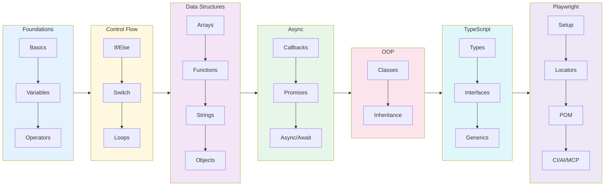

---

## 📖 What's in Chapter 1 (Available Now)

### Files

| File | Topic | What you'll learn |
|------|-------|-------------------|
| `01_Basics.js` | Hello World | First `console.log`, declaring a variable |
| `02_JS.js` | Variables & Loops | Re-declaring with `let`, calling functions inside loops |
| `03_JS_Verify_Setup.js` | Environment Check | `process.platform`, `process.arch`, `process.version` |
| `04_HotCode.js` | Hot Code Paths | How V8 optimizes frequently-called functions |

### Key Concepts

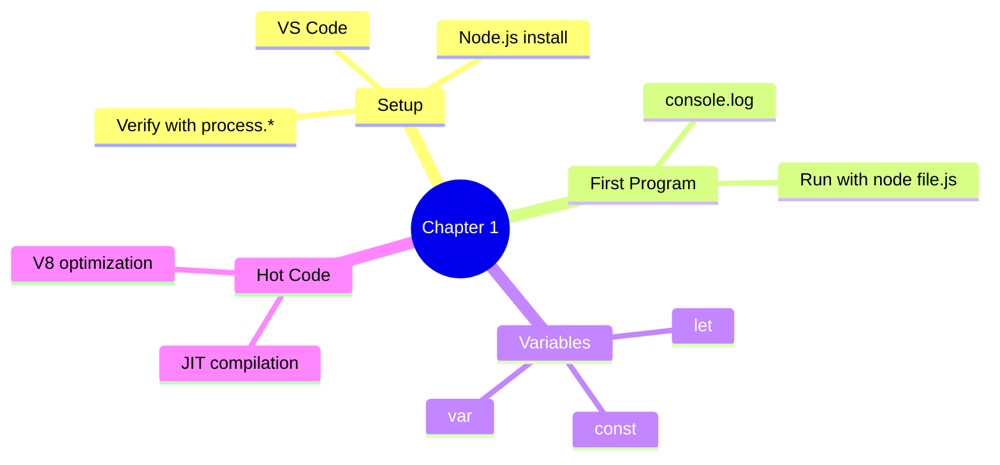

### Run them

```bash
node chapter_01_Basics/01_Basics.js          # → "Hello The Testing Academy"
node chapter_01_Basics/02_JS.js              # → counts to 100000 calling print()
node chapter_01_Basics/03_JS_Verify_Setup.js # → prints platform / arch / node version
node chapter_01_Basics/04_HotCode.js         # → triggers V8 hot-path optimization
```

---

## 📖 What's in Chapter 2 (Available Now)

### Files

| File | Topic | What you'll learn |
|------|-------|-------------------|
| `05_JS_Basics.js` | JS Basics | Variables, assignment, console output |

---

## 📖 What's in Chapter 3 (Available Now)

### Files

| File | Topic | What you'll learn |
|------|-------|-------------------|
| `06_Identifier_Rules.js` | Identifier Rules | Valid names (`$`, `_`, camelCase) |
| `07_Identifier_Part2.js` | Naming Conventions | camelCase, PascalCase, snake_case, SCREAMING_SNAKE_CASE |
| `08_Comments.js` | Comments | Single-line, multi-line & JSDoc style |
| `js_identifier_rules.js` | Reference | Quick identifier rules cheat-sheet |
| `VS_Code_keyboard_shortcut_mac.md` | Shortcuts | VS Code keyboard shortcuts for macOS |
| `VS_Code_keyboard_shortcut_windows.md` | Shortcuts | VS Code keyboard shortcuts for Windows |

### Key Concepts

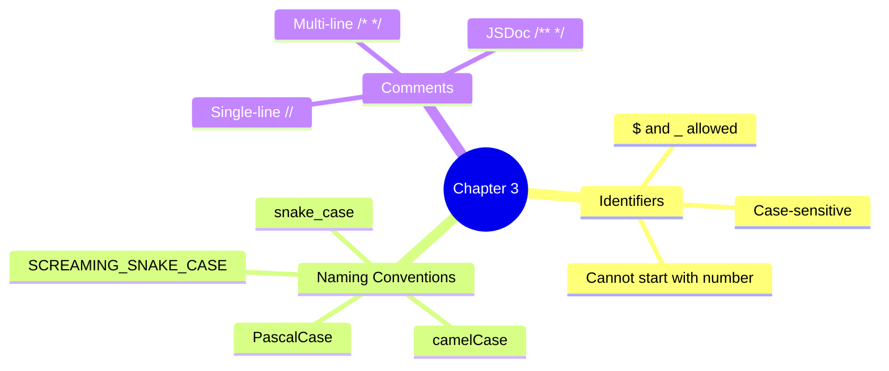

---

## 📖 What's in Chapter 4 (Available Now)

### Files

| File | Topic | What you'll learn |
|------|-------|-------------------|
| `09_var_let_const.js` | var, let, const | Declaration, re-declaration, reassignment |
| `10_functions.js` | Functions | Declaring and calling functions |
| `11_var_explained.js` | var Deep Dive | How `var` works in loops & functions |
| `12_let_peope_love.js` | let Deep Dive | Block-scoped `let` behavior |
| `13_const_explained.js` | const Deep Dive | Immutable bindings with `const` |
| `14_var_functionscope.js` | Function Scope | `var` scoped to functions |
| `15_let_scope.js` | Block Scope | `let` scoped to blocks `{}` |
| `16_Hoisting.js` | Hoisting | Variable hoisting & `undefined` |
| `17_hoisting_fn.js` | Function Hoisting | How function declarations are hoisted |
| `18_let_hoisting.js` | let TDZ | Temporal Dead Zone — why `let` errors before declaration |
| `19_let_hoisting_block.js` | Block TDZ | Inner-block `let` does **not** inherit outer value |
| `20_let_const.js` | const Hoisting | `const` is hoisted too — same TDZ rules apply |
| `21_Jr_QA.js` | Interview Q&A | Classic TDZ trap with `const` (junior SDET quiz) |

### Key Concepts

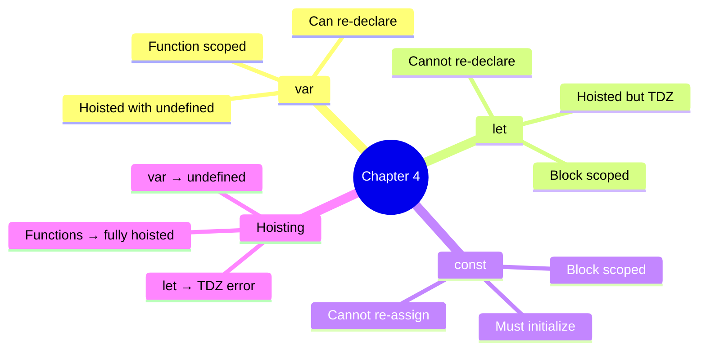

### Run them

```bash
node chapter_04_Javascript_Concepts/09_var_let_const.js  # → var, let, const behavior
node chapter_04_Javascript_Concepts/16_Hoisting.js       # → see hoisting in action
node chapter_04_Javascript_Concepts/18_let_hoisting.js   # → throws TDZ ReferenceError
node chapter_04_Javascript_Concepts/21_Jr_QA.js          # → interview-style TDZ trap
```

### 18 — Temporal Dead Zone (TDZ)

**Concept:** TDZ is the window between when a `let`/`const` is hoisted to the top of its block and when its declaration line is actually reached. Inside that window any read or write throws `ReferenceError: Cannot access 'x' before initialization`.

**Why:** Catches use-before-declare bugs at the source — unlike `var`, which silently returns `undefined` and hides the bug until runtime.

**Q&A — why use this?**
- **Q: Are `let` and `const` really hoisted?** A: Yes — but to a "not yet usable" state. The binding exists; the value does not. That gap is the TDZ.
- **Q: How is this different from `var`?** A: `var` is hoisted **and** initialized to `undefined` immediately. `let`/`const` are hoisted but uninitialized — touching them = ReferenceError.
- **Q: Why does the interview question with `const c` throw?** A: The `console.log(c)` runs **inside** the TDZ of `const c = "pramod"`. Hoisting is not "no declaration"; it's "declaration parked, value not yet set".

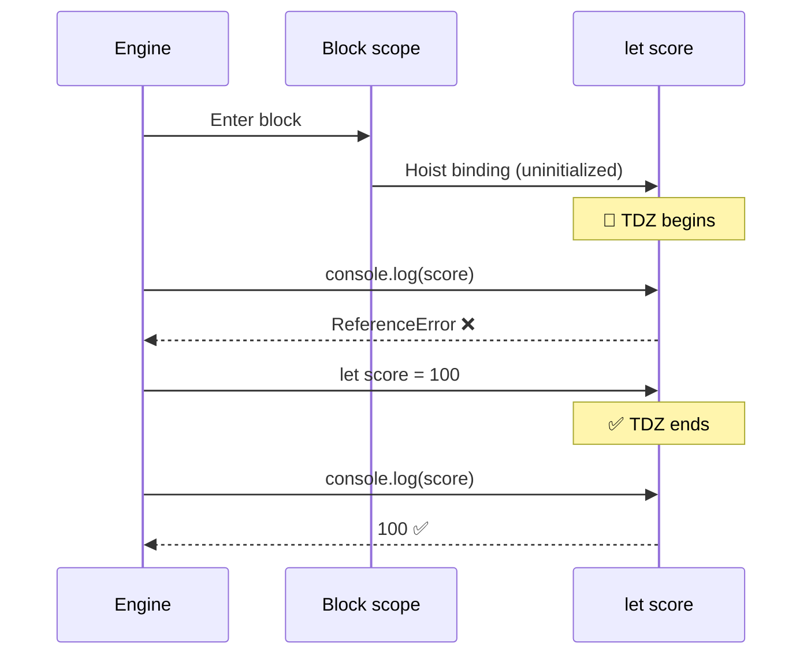

```js
// 18_let_hoisting.js — TDZ in action
console.log(score); // ❌ ReferenceError: Cannot access 'score' before initialization
let score = 100;

{
    // ---- TDZ for inner "score" starts ----
    // console.log(score);  // ❌ ReferenceError
    // typeof score;        // ❌ ReferenceError (!! typeof normally never throws)
    let score = 100;        // ✅ TDZ ends here
    console.log(score);     // 100
}
```

| Trap | `var` | `let` / `const` |
|:-----|:-----:|:---------------:|
| Read before declaration | `undefined` | **ReferenceError** |
| Re-declare in same scope | ✅ allowed | ❌ SyntaxError |
| Scope | Function | Block `{}` |
| Hoisted? | ✅ + initialized | ✅ but in TDZ |

---

## 📖 What's in Chapter 5 — Literals (Available Now)

### Files

| File | Topic | What you'll learn |
|------|-------|-------------------|
| `22_Literal.js` | Literals + `typeof` | String, number, boolean, null, undefined literals |
| `23_null_undefined.js` | null vs undefined | Who sets them, when to use which, the `typeof null === 'object'` quirk |
| `24_null.js` | Empty values | `null`, `undefined`, `""`, `0` — same role, different types |
| `25_Literal_All.js` | All literals | Whirlwind tour of every literal form |
| `26_Literal_Number_all.js` | Number literals | Decimal, binary `0b`, octal `0o`, hex `0x`, BigInt `n`, `1e6`, `1_000_000`, `NaN`, `Infinity` |
| `27_String.js` | Quotes | Single `'…'` vs double `"…"` strings (interchangeable) |
| `28_Template_Literal.js` | Backticks | `` `${var}` `` interpolation — Playwright selectors, log lines, screenshot paths |
| `29_Backtick_single_double.js` | `'` vs `"` vs `` ` `` | One-page comparison + migration from `+`-concatenation |

### Key Concepts

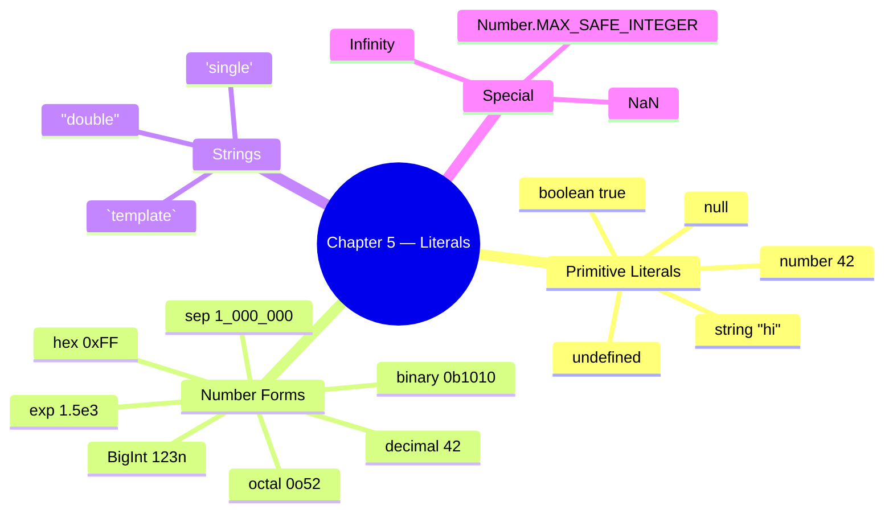

### Run them

```bash
node chapter_05_Literal/22_Literal.js              # → typeof for each literal
node chapter_05_Literal/23_null_undefined.js       # → null vs undefined walkthrough
node chapter_05_Literal/26_Literal_Number_all.js   # → every number literal form
node chapter_05_Literal/28_Template_Literal.js     # → backtick interpolation
```

---

### 22 — What is a Literal?

**Concept:** A *literal* is a value written **directly** in source code — `42`, `"hello"`, `true`, `null`. It's the raw value, not a variable referring to one.

**Why:** Every value in a JS program either comes from a literal you typed or was derived from one. Knowing the literal forms = knowing the JS type system.

**Q&A — why use this?**
- **Q: Why does `typeof null` return `"object"`?** A: 26-year-old JavaScript bug — preserved for backwards compatibility. Test against `null` with `value === null`, never `typeof`.
- **Q: Is `undefined` a literal?** A: Practically yes, but it's actually a property of the global object. Never assign `undefined` manually — let JS produce it.
- **Q: Why does `typeof` on a never-declared variable not throw?** A: `typeof` is the **only** operator that's TDZ-safe for *undeclared* identifiers. Returns `"undefined"`. (But TDZ for `let`/`const`? Still throws — see Ch 4.)

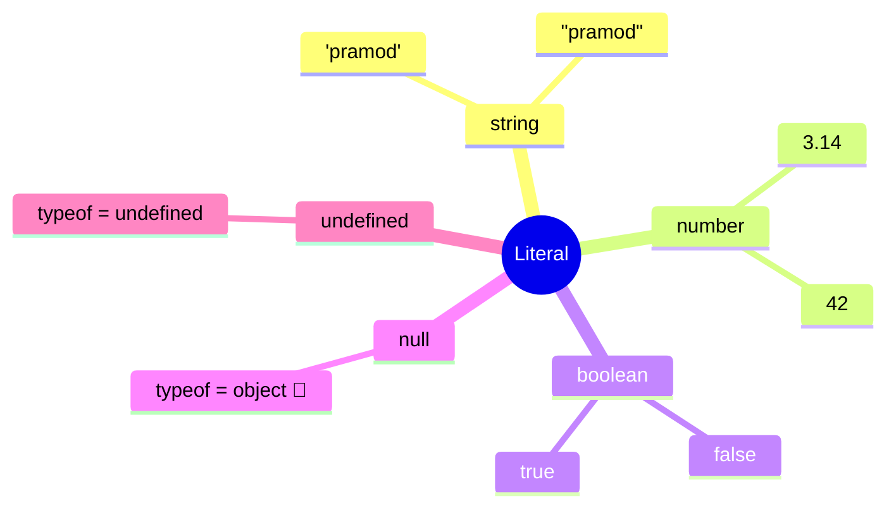

```js
// 22_Literal.js
let age = "pramod";        // string literal
let isStudent = true;      // boolean literal
let pi = 3.14;             // number literal
let nullValue = null;      // null literal
let undefinedValue;        // implicitly undefined

console.log(typeof age);            // "string"
console.log(typeof pi);             // "number"
console.log(typeof isStudent);      // "boolean"
console.log(typeof nullValue);      // "object"   ← JS bug, kept forever
console.log(typeof undefinedValue); // "undefined"
```

---

### 23 — null vs undefined

**Concept:** Both mean "no value", but: `undefined` = JS set it (uninitialized, missing return); `null` = developer set it on purpose ("explicitly empty").

**Why:** Mixing them up causes 90% of "Cannot read properties of undefined" bugs in test code — knowing which to expect tells you whether the bug is in your code or the SUT.

**Q&A — why use this?**
- **Q: When should *I* assign `null`?** A: When you want to deliberately **clear** a reference (`user = null`) or signal "intentionally empty". Never reach for `undefined` — let JS produce it.
- **Q: `null == undefined` → ?** A: `true` with `==`, `false` with `===`. Always use `===` to keep them distinct in test assertions.
- **Q: Playwright API returns null — what does that mean?** A: "Element/value asked for does not exist." Returns `undefined` → "API wasn't called" or "property missing". Different bug categories.

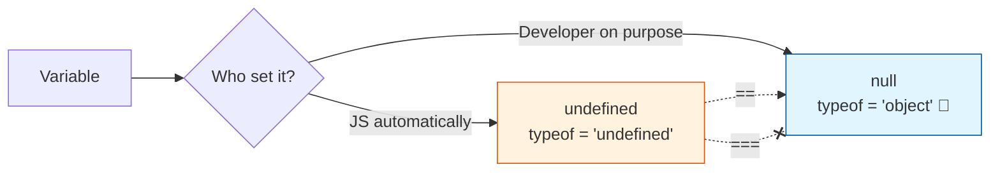

```js
// 23_null_undefined.js
let userName;                         // JS sets it
console.log(userName);                // undefined
console.log(typeof userName);         // "undefined"

let profilePicture = null;            // developer sets it
console.log(profilePicture);          // null
console.log(typeof profilePicture);   // "object"  ← classic JS quirk

let a;
let b = null;
console.log(a == b);   // true  ← loose equality
console.log(a === b);  // false ← strict equality (different types)
```

| | `undefined` | `null` |
|:-:|:-:|:-:|
| Set by | JavaScript | Developer |
| `typeof` | `"undefined"` | `"object"` (bug) |
| Use case | "Not initialized yet" | "Cleared on purpose" |
| Assertion in tests | `expect(x).toBeUndefined()` | `expect(x).toBeNull()` |

---

### 26 — Number Literals (every form)

**Concept:** JS has one `number` type (IEEE-754 double) — but many ways to *write* a number: decimal, binary `0b`, octal `0o`, hex `0x`, exponential `1.5e3`, separators `1_000_000`, and `BigInt` (`123n`) for huge integers.

**Why:** Choosing the right literal form makes code self-documenting — `0xFF` says "byte mask", `0b1010_0001` says "bit flags", `1_000_000` says "one million, not ten thousand".

**Q&A — why use this?**
- **Q: When do I need BigInt?** A: When values exceed `Number.MAX_SAFE_INTEGER` (`2^53 - 1` = `9007199254740991`). Common in timestamps-with-nanoseconds, blockchain IDs, large DB IDs.
- **Q: `0 / 0` returns?** A: `NaN`. And `typeof NaN === "number"` (yes, really). Test with `Number.isNaN(x)` — **not** `x === NaN` (which is always `false`).
- **Q: Why is `0.1 + 0.2 !== 0.3`?** A: IEEE-754 float rounding. Compare with `Math.abs(a - b) < Number.EPSILON` for currency, or store cents as integers.

```mermaid
mindmap
  root((number))
    Integer
      decimal 42
      binary 0b1010
      octal 0o52
      hex 0x2A
    Float
      3.14
      1.5e3
      1.5e-3
    Readable
      1_000_000
      0xFF_FF
    BigInt
      123n
      BigInt&#40;42&#41;
    Special
      Infinity
      -Infinity
      NaN
```

```js
// 26_Literal_Number_all.js
let decimal = 42;
let binary  = 0b1010;          // 10
let octal   = 0o52;            // 42
let hex     = 0x2A;            // 42
let exp     = 1.5e3;           // 1500
let million = 1_000_000;       // 1000000 (ES2021 separator)
let big     = 123456789012345678901234567890n; // BigInt

console.log(1 / 0);                          // Infinity
console.log(0 / 0);                          // NaN
console.log(typeof NaN);                     // "number"
console.log(Number.MAX_SAFE_INTEGER);        // 9007199254740991
```

---

### 28 — Template Literals (Backticks)

**Concept:** A string wrapped in backticks `` ` `` that supports `${expression}` interpolation and real multi-line text — no `+` concatenation, no `\n` escapes.

**Why:** Building Playwright selectors, log lines, dynamic API URLs, and screenshot paths from variables is **everywhere** in test code. Template literals are the cleanest way to do it.

**Q&A — why use this?**
- **Q: When should I prefer backticks over `'…'` / `"…"`?** A: Any string with a variable inside, any multi-line string, any string with an embedded expression. Plain text? Either is fine — be consistent.
- **Q: Can I run code inside `${…}`?** A: Yes — any JS expression: `` `${a + b}` ``, `` `${user.toUpperCase()}` ``, `` `${Date.now()}` ``. Statements (if/for) don't fit, but ternaries do.
- **Q: Do backticks work in JSON?** A: No — JSON only allows `"…"`. Use backticks to **build** the JSON string in JS, then send it.

```mermaid
flowchart LR
    A[rowIndex = 3] --> T["`[data-row=&dollar;{rowIndex}]`"]
    B[columnName = 'email'] --> T
    T --> P[page.locator&#40;…&#41;]
    P --> C[Click cell]
    style T fill:#fff3e0,stroke:#e65100
```

```js
// 28_Template_Literal.js — typical Playwright/test-code use
const rowIndex = 3;
const columnName = "email";
await page.locator(`[data-row="${rowIndex}"] [data-col="${columnName}"]`).click();

const testName = "Login Test";
const status = "FAILED";
const duration = 2.3;
console.log(`[${status}] ${testName} completed in ${duration}s`);

const testCase = "checkout_flow";
const timestamp = Date.now();
await page.screenshot({ path: `screenshots/${testCase}_${timestamp}.png` });
```

| Need | `'…'` / `"…"` | `` `…` `` |
|:-----|:-:|:-:|
| Plain text | ✅ | ✅ |
| `${variable}` interpolation | ❌ | ✅ |
| Multi-line without `\n` | ❌ | ✅ |
| Expression `${a + b}` | ❌ | ✅ |
| JSON-compatible | ✅ | ❌ |

---

## 📖 What's in Chapter 6 — Operators (Available Now)

### Files

| File | Topic | What you'll learn |
|------|-------|-------------------|
| `30_Operator.js` | Assignment | `=` puts the right-hand value into the left-hand binding |
| `31_Arithmetic_OP.js` | Arithmetic | `+`, `-`, `*`, `/` on numbers |
| `32_Modulus_OP.js` | Modulus | `%` remainder — odd/even check (`n % 2 === 0`) |
| `33_Expo_OP.js` | Exponentiation | `**` power (`2 ** 3 === 8`) |
| `34_IQ.js` | Compound | `+=`, `-=`, `*=`, `/=`, `%=` shorthand |
| `35_Comparsion_OP.js` | Comparison | `>`, `<`, `>=`, `<=`, `==`, `===`, `!=`, `!==` → boolean |
| `36_Comparsion_Strict_loose.js` | Loose vs strict | Why `42 == "42"` is `true` but `42 === "42"` is `false` |
| `37_IQ_Loose_Strict.js` | Interview quick-fire | `0 == ""`, `0 == "0"`, `"" == "0"` — transitivity broken |
| `38_Confusing_Comparsion.js` | 🔥 == vs === | NaN, `[]`, `null`/`undefined`, `typeof null`, `[] == ![]` |
| `39_Logical_Op.js` | Logical | `&&`, `\|\|`, `!` on booleans |
| `40_String_Con_Op.js` | String concat | `+` on strings glues them (`"Hi" + " Dev"`) |
| `41_Ternary_Op.js` | Ternary `? :` | One-line `if/else` — SLA checks, env-based URLs, nested ternaries |
| `42_Type_Op.js` | `typeof` | Type tag for any value (`"string"`, `"number"`, `"object"`, `"undefined"`) |
| `43_Incre_Decre_Op.js` | `++` / `--` | Pre vs post increment/decrement — when each is evaluated |
| `44_Null_Op.js` | Nullish `??` | Fallback **only** for `null`/`undefined` (unlike `\|\|`) |
| `45_Post_Increment.js` | Post `++` | `a++` returns old value, then increments |
| `46_IQ_INCREMENT_D.js` | Interview Q | What does `let r = a++` log? |
| `47_Advance_ID_.js` | 🔥 IQ Trap | `++a + ++a` — read-modify-write order in one expression |

### Key Concepts

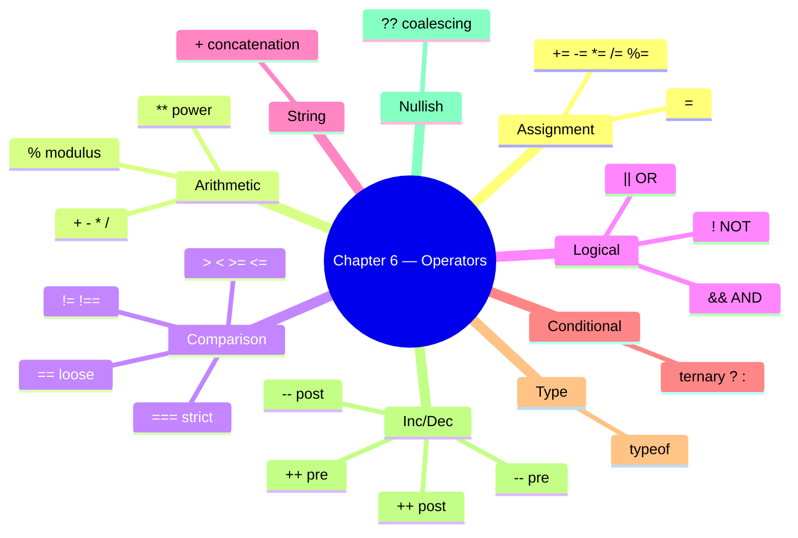

### Run them

```bash
node chapter_06_Operator/31_Arithmetic_OP.js          # → sum, sub, mul, div
node chapter_06_Operator/32_Modulus_OP.js             # → 13 % 7, odd/even via % 2
node chapter_06_Operator/36_Comparsion_Strict_loose.js # → 42 == "42" vs 42 === "42"
node chapter_06_Operator/38_Confusing_Comparsion.js   # → full == vs === reference
node chapter_06_Operator/41_Ternary_Op.js             # → ternary, nested, SLA, env URLs
node chapter_06_Operator/43_Incre_Decre_Op.js         # → ++ / -- pre vs post
node chapter_06_Operator/44_Null_Op.js                # → ?? nullish fallback
node chapter_06_Operator/47_Advance_ID_.js            # → ++a + ++a IQ trap
```

---

### 30 — Operators Overview (Assignment, Arithmetic, Modulus, Exponent, Compound)

**Concept:** Operators take 1–2 values and return a new value. Assignment writes a binding (`=`); arithmetic does math (`+ - * / % **`); compound combines both (`x += 3` = `x = x + 3`).

**Why:** Every expression in a JS program is built from operators — count loops, totals, percentages, screenshot filenames with `+`, test data math. Get the precedence wrong and the assertion is wrong.

**Q&A — why use this?**
- **Q: What's `%` actually for in tests?** A: Even/odd row striping (`i % 2 === 0`), every-Nth iteration (`i % 10 === 0` → log progress), modular bucketing of test data.
- **Q: Why prefer `x += 1` over `x = x + 1`?** A: One read of `x`, one write — same outcome, fewer keystrokes, and `+=` works on strings too (`s += " more"`).
- **Q: Is `**` the same as `Math.pow`?** A: Same numeric result. `**` is the operator (ES2016+), `Math.pow(2, 3)` is the legacy function. Prefer `**`.

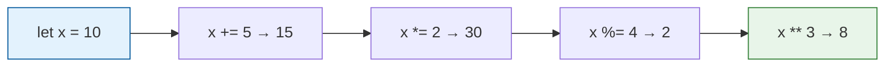

```js
// 31, 32, 33, 34 — combined
let a = 10, b = 3;
console.log(a + b);        // 13
console.log(a - b);        // 7
console.log(a * b);        // 30
console.log(a / b);        // 3.333...
console.log(a % b);        // 1   ← remainder
console.log(2 ** 10);      // 1024

// Compound assignment — same x, mutated step by step
let x = 10;
x += 10;  // 20
x -= 3;   // 17
x *= 2;   // 34
x /= 17;  // 2
x %= 2;   // 0
console.log(x);            // 0
```

---

### 35 — Comparison: `==` vs `===`

**Concept:** Comparison operators return `true`/`false`. `==` (loose) coerces types before comparing — `42 == "42"` is `true`. `===` (strict) requires same type AND same value — `42 === "42"` is `false`.

**Why:** 90% of mystery test failures around equality are caused by accidental loose equality. Strict (`===`) is the safe default; loose (`==`) is reserved for one specific trick.

**Q&A — why use this?**
- **Q: When is `==` ever the right choice?** A: One case only — `if (x == null)` matches both `null` and `undefined` in one shot. Everywhere else use `===`.
- **Q: Is `>=` strict or loose?** A: `>=`, `<=`, `>`, `<` always coerce — there is no strict version. That's why `null >= 0` is `true` even though `null == 0` is `false`.
- **Q: Why does Playwright's `expect()` not have this problem?** A: It compares with deep strict equality internally — but **your** code outside `expect()` (filters, IDs, conditions) is where `==` bites you.

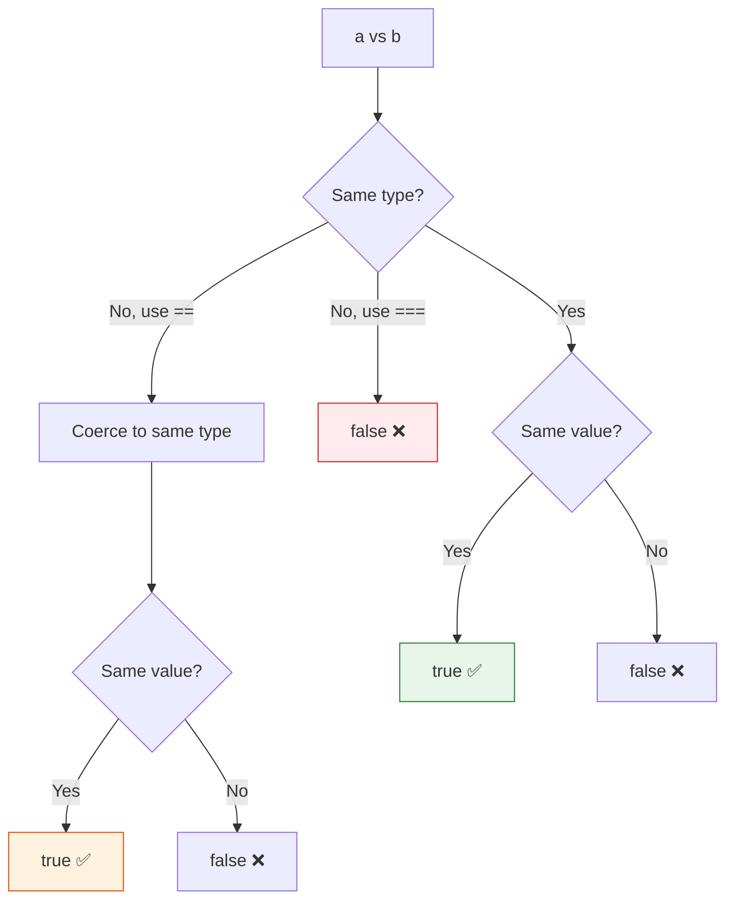

```js
// 36_Comparsion_Strict_loose.js
console.log(42 == "42");   // true   — string "42" coerced to number 42
console.log(42 === "42");  // false  — different types, strict rejects
console.log(42 == "45");   // false  — coerced, values still differ

console.log(true == 1);    // true   — true coerces to 1
console.log(false == 0);   // true   — false coerces to 0
console.log(true == "1");  // true   — both → 1

console.log(5 !== "5");    // true   — strict not-equal (type differs)
```

| Operator | Coerces? | Use when |
|:--------:|:--------:|:---------|
| `===` | ❌ | Default — always |
| `!==` | ❌ | Default — always |
| `==` | ✅ | Only `x == null` (matches null + undefined) |
| `!=` | ✅ | Only `x != null` |
| `>`, `<`, `>=`, `<=` | ✅ (no strict variant) | Numeric comparisons — guard for `null`/`NaN` first |

---

### 38 — Confusing Comparisons (the hall of fame)

**Concept:** Loose equality (`==`) walks a coercion algorithm that produces results no human would predict. `"" == 0` is `true`; `null >= 0` is `true` but `null == 0` is `false`; `NaN == NaN` is `false`; `[] == ![]` is `true`. These aren't bugs — they're spec, and they will eat your tests.

**Why:** Interviewers love these. Test runners hit them in filter conditions. Knowing the eight patterns below means you stop debugging and start fixing.

**Q&A — why use this?**
- **Q: Why is `null >= 0` true but `null == 0` false?** A: `>=` coerces `null` to `0` (relational rule). `==` has a special rule: `null` only equals `null` and `undefined`. Two different algorithms.
- **Q: How do I correctly check for `NaN`?** A: `Number.isNaN(x)` or `Object.is(x, NaN)`. **Never** `x === NaN` — it's always `false` because NaN equals nothing, not even itself.
- **Q: What's `[] == ![]` and why is it `true`?** A: `![]` → `false` → `0`. `[]` → `""` → `0`. `0 == 0` → `true`. The exclamation flips the empty array to false before coercion catches up.

```mermaid
flowchart LR
    NaN["NaN == NaN<br/>→ false"] --> Use[Use Number.isNaN&#40;x&#41;]
    Null["null == undefined<br/>→ true"] --> Pair[Only null/undefined pair like this]
    Empty["'' == 0<br/>'0' == 0<br/>'' == '0'  ← false"] --> Trans[Transitivity broken 🤯]
    Arr["[] == ![]<br/>→ true"] --> Trick[![] → false → 0;  [] → '' → 0]
    style NaN fill:#ffebee,stroke:#c62828
    style Empty fill:#fff3e0,stroke:#e65100
    style Arr fill:#fce4ec,stroke:#ad1457
```

```js
// 38_Confusing_Comparsion.js — the eight patterns
console.log("" == 0);             // true   — "" → 0
console.log("0" == 0);            // true   — "0" → 0
console.log("" == "0");           // false  — both strings, no coercion
console.log(null == undefined);   // true   — special rule
console.log(null == 0);           // false  — null only == undefined
console.log(null >= 0);           // true   — relational coerces null → 0
console.log(NaN === NaN);         // false  — NaN never equals anything
console.log(Number.isNaN(NaN));   // true   — correct check
console.log([] == false);         // true   — [] → "" → 0; false → 0
console.log([] == ![]);           // true   — !![] flips, both sides → 0
console.log(typeof null);         // "object" — 26-year legacy bug
```

**Takeaway:** Always reach for `===` / `!==`. Reserve `==` for one pattern only: `if (x == null)`. Use `Number.isNaN` for NaN, `Object.is` for `-0` vs `+0` edge cases.

---

### 39 — Logical & String Concatenation

**Concept:** Logical operators (`&&`, `||`, `!`) combine booleans. `&&` returns the first falsy or the last value; `||` returns the first truthy or the last value; `!` flips. `+` on a string concatenates — `"Hi" + " Dev"` → `"Hi Dev"` (use template literals for anything fancier).

**Why:** Conditional rendering of test data (`name || "Anonymous"`), guarding optional config (`opts && opts.headless`), and building dynamic log lines all live here.

**Q&A — why use this?**
- **Q: What does `user.name || "Guest"` actually return?** A: `user.name` if it's truthy (non-empty string, non-zero, etc.); otherwise the string `"Guest"`. Common default-value idiom.
- **Q: Why is `0 || "fallback"` not `0`?** A: `0` is falsy, so `||` skips it. If you want "use 0 if it's 0, fallback only if null/undefined", use `??` (nullish coalescing — coming in file 44).
- **Q: When should I drop `+` for strings?** A: Any time more than one variable is involved. Template literals (`` `Hi ${name}` ``) win on readability and avoid type-coercion surprises (`1 + "2"` → `"12"`).

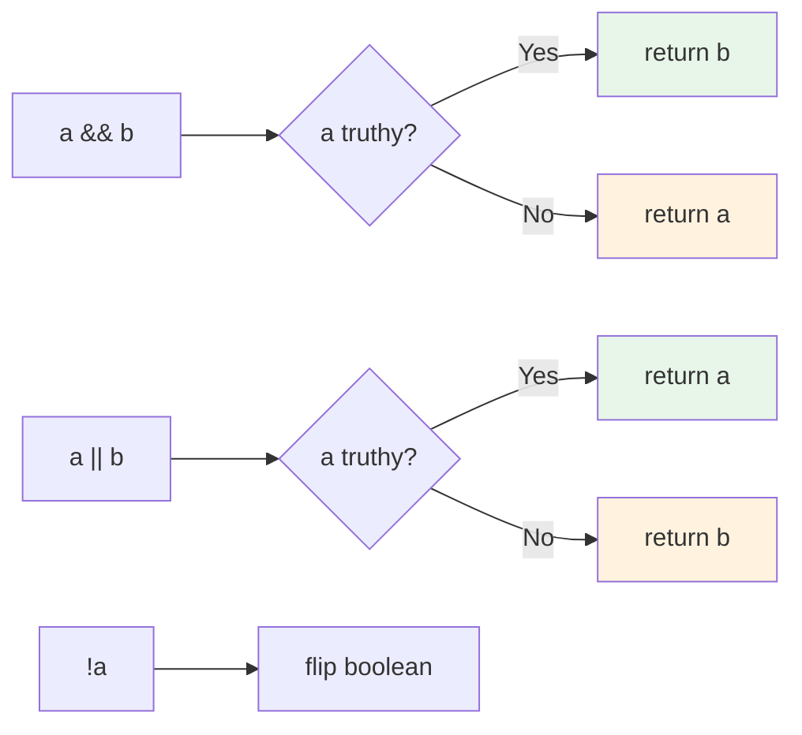

```js
// 39_Logical_Op.js + 40_String_Con_Op.js
let a = true;
let b = false;
console.log(a && b);   // false  — AND: both must be true
console.log(a || b);   // true   — OR: either is enough
console.log(!a);       // false  — NOT: flip

// short-circuit defaults
const userName = "" || "Guest";   // "Guest" — "" is falsy
const port     = 0  || 3000;      // 3000   — but use ?? if 0 is a valid value!

// string concatenation
let s = "Hi";
s += " Dev";
console.log(s);        // "Hi Dev"
```

---

### 41 — Ternary Operator `? :`

**Concept:** Ternary is a three-part expression — `condition ? whenTrue : whenFalse` — that **returns** a value. It's the only operator in JS that takes three operands and the cleanest way to assign one of two values based on a boolean.

**Why:** In test code, you reach for it constantly — pick the base URL by environment, pick `headless`/`headed` by CI flag, format pass/fail status, choose retry counts. Ternary keeps the decision and the assignment on one line.

**Q&A — why use this?**
- **Q: Ternary vs `if/else` — which when?** A: Use ternary when you're **returning or assigning** one of two values. Use `if/else` when you're running **side-effect statements** (logging multiple lines, mutating multiple vars). One value out → ternary. Multiple actions → `if/else`.
- **Q: Nested ternary — yes or no?** A: 2 levels max, formatted vertically (see `statusCode` example). Beyond that, switch to a lookup map or `if/else if`. Junior reviewers won't follow 4-deep nesting.
- **Q: Can I `await` inside a ternary?** A: Yes — `await (flag ? api.fast() : api.slow())`. The arms are expressions, so promises are fine.

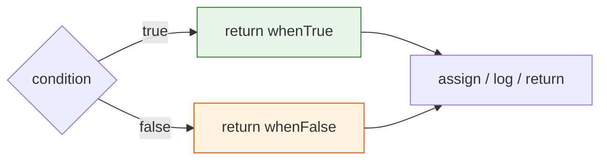

```js
// 41_Ternary_Op.js — real test-code patterns

// 1) Environment-driven base URL
const env = "staging";
const baseUrl = env === "prod"
    ? "https://api.example.com"
    : "https://staging-api.example.com";

// 2) CI-aware browser mode
const isCI = true;
const browserMode = isCI ? "headless" : "headed";

// 3) SLA check formatted inline
const responseTime = 850, sla = 1000;
const slaStatus = responseTime <= sla ? "Within SLA ✅" : "SLA breached ❌";

// 4) Nested ternary — HTTP status category (format vertically!)
const statusCode = 404;
const category =
    statusCode < 300 ? "Success" :
    statusCode < 400 ? "Redirect" :
    statusCode < 500 ? "Client Error" : "Server Error";
console.log(`Status ${statusCode}: ${category}`);   // Status 404: Client Error
```

| Use ternary when | Use `if/else` when |
|:--|:--|
| Returning / assigning a value | Running multiple statements |
| One simple condition | Multiple branches or side effects |
| Result fits on 1–2 lines | Body needs `{ … }` |

---

### 42 — `typeof` Operator

**Concept:** `typeof x` returns a **string** naming the type of `x` — `"string"`, `"number"`, `"boolean"`, `"undefined"`, `"object"`, `"function"`, `"bigint"`, `"symbol"`. It's a unary operator that never throws (even for undeclared identifiers).

**Why:** In assertions, fixtures, and guards you constantly need to ask "is this thing the type I expect?". `typeof` is the safe, fast answer for primitives — and the *only* way to test for `undefined` without a `ReferenceError` when the variable might not be declared.

**Q&A — why use this?**
- **Q: Why does `typeof []` return `"object"` and not `"array"`?** A: Arrays are objects under the hood. Use `Array.isArray(x)` to test for arrays — `typeof` can't tell array from plain object.
- **Q: Why does `typeof null` say `"object"`?** A: 26-year-old bug locked in for backwards compatibility. Test for null with `x === null`, never `typeof`.
- **Q: Is `typeof` safe on undeclared variables?** A: Yes — `typeof neverDeclared` → `"undefined"`. That makes it the *only* operator that doesn't throw a `ReferenceError` on a missing global. Useful for feature-detection (`typeof window !== "undefined"`).

```mermaid
mindmap
  root((typeof))
    "string"
      'pramod'
      "hi"
      `tpl`
    "number"
      42
      3.14
      NaN 🤯
    "boolean"
      true
      false
    "undefined"
      let x;
    "object"
      null 🐛
      []
      {}
    "function"
      ()=>{}
    "bigint"
      123n
```

```js
// 42_Type_Op.js
console.log(typeof "hello");   // "string"
console.log(typeof 123);       // "number"
console.log(typeof 31.4);      // "number"   ← no int/float split
console.log(typeof true);      // "boolean"
console.log(typeof undefined); // "undefined"
console.log(typeof null);      // "object"   ← classic JS bug
console.log(typeof []);        // "object"   ← arrays ARE objects
console.log(typeof {});        // "object"
console.log(typeof function() {}); // "function"
console.log(typeof 123n);      // "bigint"
```

| To detect | Don't use | Use |
|:--|:--|:--|
| `null` | `typeof x` | `x === null` |
| Array | `typeof x` | `Array.isArray(x)` |
| `NaN` | `typeof x === "number"` | `Number.isNaN(x)` |
| Undefined global | bare reference (throws) | `typeof x === "undefined"` |

---

### 43 — Increment / Decrement (`++` / `--`)

**Concept:** `++` adds 1, `--` subtracts 1. The position matters: **pre** (`++a`) increments **first**, then returns the new value. **Post** (`a++`) returns the **old** value, then increments. Same logic for `--`.

**Why:** Loop counters, retry counts, version bumps, and a beloved class of interview puzzles. Mixing pre/post in one expression is the #1 way junior devs get the wrong number.

**Q&A — why use this?**
- **Q: When does pre vs post actually matter?** A: Only when the value is **used in the same expression**. Standalone `i++;` and `++i;` behave identically. Inside `let b = a++` vs `let b = ++a` — the value of `b` differs.
- **Q: Is `++` allowed on `const`?** A: No — `++`/`--` reassign the binding (`x = x + 1`), so `const` throws `TypeError: Assignment to constant variable`.
- **Q: Should I use `++` in tests or stick to `+= 1`?** A: Either works. `+= 1` reads slightly more explicit and avoids the pre/post mistake entirely. Many style guides ban `++` for this reason.

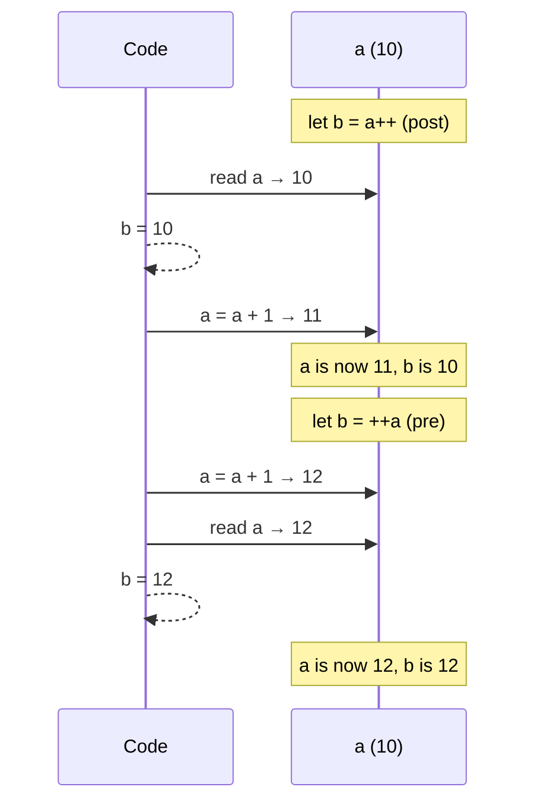

```js
// 43_Incre_Decre_Op.js  +  45_Post_Increment.js  +  46_IQ_INCREMENT_D.js

// Post-decrement: return OLD, then decrement
let a = 10;
let b = a--;
console.log(b);   // 10  ← old value
console.log(a);   //  9  ← decremented after

// Post-increment: return OLD, then increment
let a_post = 10;
let p = a_post++;
console.log(a_post); // 11
console.log(p);      // 10

// Interview: what does this log?
let x = 34;
let result = x++;
console.log(result); // 34   ← post returns old
console.log(x);      // 35
```

| Form | Returns | Then |
|:----:|:--------|:-----|
| `++a` | new value (a+1) | a is incremented |
| `a++` | old value (a) | a is incremented |
| `--a` | new value (a-1) | a is decremented |
| `a--` | old value (a) | a is decremented |

---

### 44 — Nullish Coalescing `??`

**Concept:** `a ?? b` returns `a` **unless** `a` is `null` or `undefined`, in which case it returns `b`. Unlike `||`, it does **not** fall through on other falsy values like `0`, `""`, or `false`.

**Why:** When `0` or `""` is a **valid** value (port number, search query, page index) but you still want to default `null`/`undefined`, `||` gives the wrong answer. `??` is the precise fix that ships in every modern config and options object.

**Q&A — why use this?**
- **Q: `??` vs `||` — when to switch?** A: Use `??` when `0`/`""`/`false` are valid values you want to keep. Use `||` when *any* falsy means "fall back" (typical for object/string defaults).
- **Q: Can I combine `??` with `&&` or `||`?** A: Only with parentheses — `a ?? b || c` is a SyntaxError. Write `(a ?? b) || c` explicitly. JS forces the parens so the precedence is unambiguous.
- **Q: Does `??` work on `NaN`?** A: No — `NaN` is **not** nullish. `NaN ?? "fallback"` returns `NaN`. Only `null` and `undefined` trigger the fallback.

```mermaid
flowchart LR
    A["a ?? b"] --> Q{a is null<br/>or undefined?}
    Q -->|Yes| RB[return b]
    Q -->|No| RA[return a]
    RA --> Note0[0, '', false → kept ✅]
    style RA fill:#e8f5e9,stroke:#2e7d32
    style RB fill:#fff3e0,stroke:#e65100
```

```js
// 44_Null_Op.js
const amul = null;
const milk = amul ?? "nandani milk";
console.log(milk);            // "nandani milk"

// The classic || vs ?? trap
const port_or = 0 || 3000;    // 3000  ← || treats 0 as falsy (wrong if 0 valid)
const port_nc = 0 ?? 3000;    //    0  ← ?? keeps 0 ✅

const query_or = "" || "default"; // "default" ← may not be what you want
const query_nc = "" ?? "default"; //        "" ← keeps empty string ✅
```

| Value | `value \|\| "fallback"` | `value ?? "fallback"` |
|:-----:|:-----------------------:|:----------------------:|
| `null` | `"fallback"` | `"fallback"` |
| `undefined` | `"fallback"` | `"fallback"` |
| `0` | `"fallback"` ❌ | `0` ✅ |
| `""` | `"fallback"` ❌ | `""` ✅ |
| `false` | `"fallback"` ❌ | `false` ✅ |
| `NaN` | `"fallback"` | `NaN` |

---

### 47 — Pre/Post Mixed in One Expression (🔥 IQ Trap)

**Concept:** When `++a` and/or `a++` appear **inside the same expression**, each sub-expression evaluates left-to-right: each `++a` mutates `a` and reads the **new** value; each `a++` reads the **old** value and mutates `a`. Track `a` step by step.

**Why:** Pure interview-trap territory — and shows up in real bugs when someone "cleverly" combines a counter increment with a use of the counter. The cure is to never write expressions like this in production. The skill is reading them when other people did.

**Q&A — why use this?**
- **Q: `let a = 10; console.log(++a + ++a)` — what's logged?** A: `23`. Step 1: `++a` → `a = 11`, returns `11`. Step 2: `++a` → `a = 12`, returns `12`. Sum: `11 + 12 = 23`.
- **Q: `let a = 10; console.log(a++ + ++a)` — what's logged?** A: `22`. Step 1: `a++` returns `10`, then `a = 11`. Step 2: `++a` → `a = 12`, returns `12`. Sum: `10 + 12 = 22`.
- **Q: Should I ever write code like this?** A: No. If a reviewer needs a whiteboard to follow your expression, rewrite as separate `a += 1` lines.

```mermaid
sequenceDiagram
    participant E as Expression
    participant a as a (10)
    Note over E,a: ++a + ++a
    E->>a: ++a → a = 11
    a-->>E: 11
    E->>a: ++a → a = 12
    a-->>E: 12
    E-->>E: 11 + 12 = 23
    Note over a: final a = 12
```

```js
// 47_Advance_ID_.js — the three IQ classics
// Track a step by step. Don't guess.

let a = 10;
console.log(++a + ++a);  // 23   (a → 11, then 12; 11+12)
console.log(a);          // 12

let b = 10;
console.log(b++ + ++b);  // 22   (b++ → 10 with b→11; ++b → 12; 10+12)
console.log(b);          // 12

let c = 10;
console.log(++c + c);    // 22   (++c → 11 then read c → 11; 11+11)
console.log(c);          // 11
```

**Takeaway:** When you see mixed `++`/`--` in an expression, replace each occurrence in your head with its pre/post rule, mutate the variable as you go, and **never write this code yourself** — use `a += 1` lines and reference `a` afterwards.

---

## 📖 What's in Chapter 7 — If / Else (Available Now)

### Files

| File | Topic | What you'll learn |
|------|-------|-------------------|
| `48_IF_ESLE.js` | Basic if/else | Vote eligibility with `age > 18` |
| `49_If_elseif_else.js` | Else-if ladder | Grade scoring (A → F) |
| `50_REAL_IF_ELSE.js` | Nested if/else | Login check → role-based access (admin / editor / viewer) |
| `51_API_IF_ELSE.js` | API branching | Status-code-driven console messages |
| `52_IQ_IF_ELSE.js` | Truthy vs falsy | Which values count as `true` / `false` in an `if` |
| `53_IF_ELSE_real.js` | Logical + if/else | Combine `&&` / `\|\|` with nested conditions (auth logic) |
| `54_IQ.js` | One-line if | `if` without braces — when it works |
| `55_IE.js` | Empty if | A bare `if (true) { }` block |
| `56_IQ_EVEN_ODD.js` | Even / odd | `% 2 === 0` check |
| `57_Grade_Calc.js` | Grade calculator | Clean else-if ladder for marks → A–F |
| `58_LEAP_YEAR.js` | Leap year | `% 4 && !% 100 \|\| % 400` rule |

### Key Concepts

```mermaid
mindmap
  root((Chapter 7 — If / Else))
    Basic
      if
      else
    Ladder
      if ... else if ... else
    Nested
      if inside if
    Truthy
      non-zero numbers
      non-empty strings
      objects / arrays
    Falsy
      0
      ""
      null
      undefined
      NaN
    Logical combo
      &&  both true
      ||  either true
```

### Run them

```bash
node chapter_07_If_else/48_IF_ESLE.js           # → "You are allowed to vote!"
node chapter_07_If_else/49_If_elseif_else.js    # → grade for score = 78
node chapter_07_If_else/50_REAL_IF_ELSE.js      # → role-based welcome message
node chapter_07_If_else/51_API_IF_ELSE.js       # → API status messages
node chapter_07_If_else/52_IQ_IF_ELSE.js        # → truthy / falsy surprise
node chapter_07_If_else/53_IF_ELSE_real.js     # → "Allowed to enter"
node chapter_07_If_else/56_IQ_EVEN_ODD.js      # → "7 is Odd"
node chapter_07_If_else/57_Grade_Calc.js       # → "Grade: B"
node chapter_07_If_else/58_LEAP_YEAR.js        # → "2024 is a Leap Year"
```

---

### 48 — Basic If / Else

**Concept:** An `if` statement evaluates a condition. If the condition is *truthy*, the first block runs; otherwise the `else` block runs. It's the simplest form of control flow.

**Why:** Every program needs decisions — "is the user logged in?", "is the API 200?", "is the price > budget?". If/else is the first tool for that.

```js
// 48_IF_ESLE.js
let age = 20;
if (age > 18) {
    console.log("You are allowed to vote!");
} else {
    console.log("You are not allowed to vote!");
}
```

---

### 52 — Truthy vs Falsy

**Concept:** In a boolean context (`if`, `while`, `&&`, `||`), JS coerces values to `true` or `false`. "Falsy" values are `0`, `""`, `null`, `undefined`, `NaN`, and `false`. Everything else is "truthy".

**Why:** Debugging "why didn't my if-block run?" usually comes down to a falsy value you didn't expect — especially `0` or `""`.

```js
// 52_IQ_IF_ELSE.js
if ("hello") console.log("String is truthy");   // prints
if (42)      console.log("Number is truthy");   // prints
if ({})      console.log("Empty object is truthy!"); // prints
if ([])      console.log("Empty array is truthy!");  // prints

if ("")      console.log("Won't print");          // "" is falsy
if (0)       console.log("Won't print");          // 0 is falsy
if (null)   console.log("Won't print");          // null is falsy
```

| Value | Truthy? |
|-------|:-------:|
| `"hello"` | ✅ |
| `42` | ✅ |
| `-1` | ✅ |
| `0` | ❌ |
| `""` | ❌ |
| `" "` | ✅ |
| `null` | ❌ |
| `undefined` | ❌ |
| `NaN` | ❌ |
| `{}` | ✅ |
| `[]` | ✅ |

---

### 58 — Leap Year

**Concept:** A year is a leap year if it is divisible by 4 **and not** divisible by 100, **or** it is divisible by 400.

**Why:** Classic interview question that tests understanding of compound boolean logic and operator precedence.

```js
// 58_LEAP_YEAR.js
let year = 2024;
if ((year % 4 === 0 && year % 100 !== 0) || year % 400 === 0) {
    console.log(year + " is a Leap Year");
} else {
    console.log(year + " is NOT a Leap Year");
}
```

---

## 📖 What's in Chapter 8 — Switch Statement (Available Now)

> 🔗 **Full walk-through:** [chapter_08_Switch_Statement/README.md](./chapter_08_Switch_Statement/README.md)

### Files

| File | Topic | What you'll learn |
|------|-------|-------------------|
| `59_Switch.js` | Switch basics | `switch (expr)` with `case` and `default` |
| `60_No_Break.js` | Fall-through | What happens when you forget `break` |
| `61_Default.js` | `default` | The catch-all branch |
| `62_REAL_TIME_EXAMPLE.js` | Real-world | Status / role / env routing with `switch` |
| `63_Switch_Group.js` | Grouped cases | Multiple `case` labels sharing one body |
| `64_IQ.js` | Interview Q | Switch trap #1 |
| `65_IQ2.js` | Interview Q | Switch trap #2 |
| `66_IQ3.js` | Interview Q | Switch trap #3 |
| `67_IQ4.js` | Interview Q | Switch trap #4 |

### Key Concepts

```mermaid
mindmap
  root((Chapter 8 — Switch))
    switch
      expression
      strict ===
    case
      value match
      break to exit
      grouped cases
    default
      fallback
    fall-through
      missing break
```

---

## 📖 What's in Chapter 9 — User Input (Available Now)

> 🔗 **Full walk-through:** [chapter_09_UserInput/README.md](./chapter_09_UserInput/README.md)

### Files

| File | Topic | What you'll learn |
|------|-------|-------------------|
| `68_User_Input.js` | `prompt()` (browser) | Browser-only API — fails in Node with `ReferenceError` |
| `69_Node_readline.js` | Node `readline` | Built-in module, async `rl.question()` for terminal input |
| `70_prompt_sync.js` | `prompt-sync` | npm package for synchronous terminal input |

### Key Concepts

```mermaid
mindmap
  root((Chapter 9 — User Input))
    Browser
      prompt&#40;&#41;
      not in Node
    Node built-in
      readline
      async callback
      rl.close&#40;&#41;
    npm package
      prompt-sync
      synchronous
      one-liner
    Always
      input is string
      Number&#40;input&#41; to parse
```

| Approach | Where it runs | Style | Needs install |
|----------|---------------|-------|:--:|
| `prompt()` | Browser only | Sync | ❌ (built-in to browser) |
| `readline` | Node | Async (callback) | ❌ (built-in to Node) |
| `prompt-sync` | Node | Sync | ✅ (`npm i prompt-sync`) |

---

## 📖 What's in Chapter 10 — Loops (Available Now)

> 🔗 **Full walk-through:** [chapter_10_Loops/README.md](./chapter_10_Loops/README.md)

### Files

| File | Topic | What you'll learn |
|------|-------|-------------------|
| `71_For_loop.js` | For loop intro | Why loops exist — replacing repeated `console.log` lines |
| `72_For_loop.js` | For with `<=` | `i = 0; i <= 5` runs 6 times (0 through 5) |
| `73_For_Loop2.js` | Loop boundaries | `i <= 10` vs `i < 10` — 11 vs 10 iterations |
| `74_IQ.js` | Loop + if/else | Combine loops with conditional branching |
| `75_For_OF_IN_EACH.js` | while retry | while loop as a retry mechanism |
| `76_While.js` | while loop | Three parts: init, condition, update |
| `77_Do_While.js` | do-while | Guaranteed one execution regardless of condition |
| `78_Do_While.js` | do-while retry | Retry with do-while (always runs at least once) |
| `79_IQ.js` | while countdown | Decrementing loop — `i--` instead of `i++` |
| `80_IQ.js` | do-while trap | Do-while off-by-one: runs once even when condition is false |
| `81_IQ.js` | continue in for | `continue` skips current iteration, next one runs |
| `82_IQ.js` | do-while infinite | do-while with always-true condition |

### Key Concepts

```mermaid
mindmap
  root((Chapter 10 — Loops))
    for
      init; condition; update
      i++ increment
      i-- decrement
    while
      checks condition first
      might never run
    do-while
      runs at least once
      checks after body
    break
      exits loop early
    continue
      skips current iteration
```

### Run them

```bash
node chapter_10_Loops/71_For_loop.js          # → 1 to 10 + introduction
node chapter_10_Loops/72_For_loop.js          # → 0, 1, 2, 3, 4, 5
node chapter_10_Loops/73_For_Loop2.js         # → 0 to 10 (11 iterations)
node chapter_10_Loops/74_IQ.js               # → for + if/else
node chapter_10_Loops/75_For_OF_IN_EACH.js   # → while retry
node chapter_10_Loops/76_While.js            # → while countdown
node chapter_10_Loops/77_Do_While.js         # → do-while guaranteed run
node chapter_10_Loops/78_Do_While.js         # → do-while retry
node chapter_10_Loops/79_IQ.js               # → 5, 4, 3, 2, 1
node chapter_10_Loops/80_IQ.js               # → 0 (do-while off-by-one)
node chapter_10_Loops/81_IQ.js               # → 0, 2 (continue skips 1)
node chapter_10_Loops/82_IQ.js               # → 1 only (infinite if not careful)
```

### 71 — For Loop

**Concept:** A `for` loop replaces manually repeating `console.log` calls. It has three parts: **initialization** (`let i = 0`), **condition** (`i < N`), and **update** (`i++`). The body runs while the condition is true.

**Why:** Anywhere you need to iterate a known number of times — processing test data rows, retrying a flaky API, generating N test values.

```js
// 71_For_loop.js — the "why loops" file
console.log(1);
console.log(2);
console.log(3);
// ... imagine 100 lines ...
console.log(10);

// For Loop — helps you repeat a block of code
```

```js
// 72_For_loop.js — basic for with <=
for (let i = 0; i <= 5; i++) {
    console.log(i);  // 0, 1, 2, 3, 4, 5
}
```

| File | `for` loop | Iterations | Output |
|:--|:--|:--:|:--|
| `72_For_loop.js` | `i = 0; i <= 5; i++` | 6 | 0, 1, 2, 3, 4, 5 |
| `73_For_Loop2.js` | `i = 0; i <= 10; i++` | 11 | 0 to 10 |
| `74_IQ.js` | `i = 0; i < 18; i++` + if/else | 18 | conditional gift logic |

**Key pattern — three parts of a for loop:**

```mermaid
flowchart LR
    I["init<br/>let i = 0"] --> C{"condition<br/>i < 5 ?"}
    C -->|true| B[run body]
    B --> U["update<br/>i++"]
    U --> C
    C -->|false| D[Done ✅]
    style I fill:#e3f2fd,stroke:#01579b
    style C fill:#fff3e0,stroke:#e65100
    style U fill:#f3e5f5,stroke:#7b1fa2
```

### 76 — While Loop

**Concept:** `while (condition) { … }` checks the condition **before** each iteration. If the condition is already false, the body **never runs**. Three essential parts: init (`let i = 0`), condition (`i < 5`), update (`i++`).

**Why:** Use when you don't know how many iterations you need — retrying an API until it succeeds, reading lines until EOF, polling until a condition is met.

```js
// 76_While.js — the three-part pattern
let attempt = 0;          // init
while (attempt < 3) {     // condition
    console.log(attempt);
    attempt++;            // update
}

let modi = 1;
while (modi <= 15) {
    console.log("Modi will do 15+ years");
    modi++;
}
```

### 77 — Do-While Loop

**Concept:** `do { … } while (condition)` runs the body **at least once** — the condition is checked *after* the body. Guaranteed one execution regardless of the condition.

**Why:** "Try once, then check if you need to retry" — perfect for login prompts, data fetch + retry, or any action that must happen at least once.

```js
// 77_Do_While.js — runs once even when a >= 10
let a = 10;
do {
    console.log(a);   // prints 10
    a++;
} while (a < 10);     // condition already false, but body ran

// 78_Do_While.js — retry pattern
let retry = 0;
do {
    console.log("Execute a code!");
    console.log("Retrying.....", retry);
    retry++;
} while (retry < 3);
```

| Loop type | Condition check | Minimum runs | When to use |
|:--|:--|:--:|:--|
| `for` | Before each iteration | 0 | Known iteration count |
| `while` | Before each iteration | 0 | Unknown count, maybe zero |
| `do-while` | After each iteration | **1** | Must run at least once |

### 79–80 — IQ: Countdown & Off-by-One

**Concept:** `i--` decrements the counter — same loop, different direction. Do-while off-by-one: when the condition starts false, it still executes once (the body prints, then the condition fails).

```js
// 79_IQ.js — countdown
let i = 5;
while (i > 0) {
    console.log(i);   // 5, 4, 3, 2, 1
    i--;
}

// 80_IQ.js — do-while off-by-one trap
let i = 0;
do {
    console.log(i);   // prints 0 (once), then condition fails
    i--;
} while (i > 0);      // i is -1, condition is false → loop ends
```

### 81 — Continue

**Concept:** `continue` skips the **rest of the current iteration** and jumps to the next one. Unlike `break`, it doesn't exit the loop — it only skips.

```js
// 81_IQ.js
for (let i = 0; i < 3; i++) {
    if (i === 1) continue;    // skip the rest when i is 1
    console.log(i);           // 0, 2
}
```

### 82 — Do-While Always-True Trap

**Concept:** A do-while loop where the condition is always true will run **forever** (infinite loop) unless you `break` or it's intentionally bounded.

```js
// 82_IQ.js — pattern: runs at least once
let n = 1;
do {
    console.log(n);   // prints 1
} while (n < 3);      // 1 < 3 → true → runs again... wait, there's no update!
```

**Takeaway:** Always include an update (`n++`) or a `break` inside a loop body. No update = infinite loop = frozen program.

---

## 📖 What's in Chapter 11 — Arrays (Available Now)

> 🔗 **Full walk-through:** [chapter_11_Arrays/README.md](./chapter_11_Arrays/README.md)

### Files

| File | Topic | What you'll learn |
|------|-------|-------------------|
| `83_Arrays.js` | Arrays basics | Literal `[]`, index access, `length`, mixed types, `undefined` out-of-bounds |
| `84_Arrays.js` | Array creation | Array literal, `new Array()`, `Array.of()`, `Array.from()` |
| `85_Access_Array.js` | Access & modify | Bracket notation `[]`, `.at()` with negative index, modifying in place |
| `86_Arrays_Adding_Remove.js` | Add/remove | `push`, `pop`, `unshift`, `shift` |
| `87_Adding_Remove2.js` | Splice | `splice(start, deleteCount, ...items)` — add, remove, replace at any position |
| `88_REAL_Example.js` | Real-world | Browser list manipulation — iterate, search, remove |
| `89_Searching.js` | Searching | `indexOf`, `lastIndexOf`, `includes`, `find`, `findIndex`, `findLast`, `findLastIndex` |
| `90_Iterate.js` | Iteration | `for`, `for...of`, `forEach`, `for...in`, `.entries()` |
| `91_Transform_Array.js` | Transform | `map`, `filter`, `reduce`, `flat` |
| `92_Arrays.js` | Sorting | `sort()` default is lexicographic; pass `(a,b)=>a-b` for numeric |
| `93_Array_Slicing.js` | `slice` vs `splice` | `slice` returns a copy (safe); `splice` mutates in place (surgery) |
| `94_Concat_array.js` | Combine | `concat`, spread `...`, `join("|")` |
| `95_Array_Checking.js` | Predicates | `Array.isArray`, `every` (ALL pass), `some` (AT LEAST ONE passes) |

### Key Concepts

```mermaid
mindmap
  root((Chapter 11 — Arrays))
    Creation
      literal []
      new Array()
      Array.of()
      Array.from()
    Access
      bracket [0]
      .at(-1)
      modify
    Add/Remove
      push (end)
      pop (end)
      unshift (start)
      shift (start)
      splice (any)
    Search
      indexOf
      lastIndexOf
      includes
      find
      findIndex
    Iterate
      for loop
      for...of
      forEach
      for...in
      .entries()
    Transform
      map
      filter
      reduce
      flat
    Sort
      default lexicographic
      (a,b)=>a-b numeric
    Slice vs Splice
      slice = copy
      splice = mutate
    Combine
      concat
      spread ...
      join
    Check
      Array.isArray
      every
      some
```

### Run them

```bash
node chapter_11_Arrays/83_Arrays.js               # → array basics, index, mixed types
node chapter_11_Arrays/84_Arrays.js               # → Array constructor, Array.of, Array.from
node chapter_11_Arrays/85_Access_Array.js         # → access, .at(-1), modify
node chapter_11_Arrays/86_Arrays_Adding_Remove.js # → push, pop, unshift, shift
node chapter_11_Arrays/87_Adding_Remove2.js       # → splice add/remove/replace
node chapter_11_Arrays/88_REAL_Example.js         # → real browser list example
node chapter_11_Arrays/89_Searching.js            # → indexOf, includes, find, findIndex
node chapter_11_Arrays/90_Iterate.js              # → 5 ways to iterate arrays
node chapter_11_Arrays/91_Transform_Array.js      # → map, filter, reduce, flat
node chapter_11_Arrays/92_Arrays.js               # → sort default (lexicographic) + numeric/desc
node chapter_11_Arrays/93_Array_Slicing.js        # → slice vs splice
node chapter_11_Arrays/94_Concat_array.js         # → concat, spread, join
node chapter_11_Arrays/95_Array_Checking.js       # → Array.isArray, every, some
```

### 83 — Arrays Basics

**Concept:** Arrays are ordered collections of values. Use literal syntax `[]` (preferred). Index starts at `0`. `length` gives count. Out-of-bounds access returns `undefined`. Arrays can hold mixed types.

**Why:** Test data comes in lists — test names, element handles, results, URLs. Arrays are the first data structure every SDET needs.

```js
// 83_Arrays.js
let fruits = [];                         // empty array
let fruits_fresh = ["apple", "banana", "cherry"];  // length = 3, index 0-2

let arr = [10, 20, 30, 40];
console.log(arr[0]);   // 10
console.log(arr[3]);   // 40
console.log(arr[4]);   // undefined (out of bounds)

let testResults = ["pass", "fail", "pass", "skip"];
let mixed = [1, "hello", true, null];    // JS arrays can hold any type
```

### 84 — Array Creation Methods

**Concept:** Beyond the literal `[]`, you can create arrays with `new Array(n)` (pre-allocates `n` empty slots), `Array.of(...items)` (safe constructor), and `Array.from(iterable)` (converts strings/iterables to arrays).

**Why:** `Array.from("hello")` → `["h","e","l","l","o"]` is perfect for splitting strings. `new Array()` with a single number argument creates sparse arrays — a common trap. Use `Array.of()` when you want predictable behavior.

```js
// 84_Arrays.js
let browsers = ["Chrome", "Firefox", "Safari"];        // literal (preferred)
let scores = new Array(3);                             // [empty × 3]
let scores2 = new Array(1, 2, 3);                      // [1, 2, 3]
let numbers = new Array(100, 200, 300, 400);           // [100, 200, 300, 400]
let test = Array.of(10, 20, 30, 40, 50);               // [10, 20, 30, 40, 50]
let chars = Array.from("hello");                       // ["h", "e", "l", "l", "o"]
```

| Method | Use when | Trap |
|:--|:--|:--|
| `[]` | **Always** (default) | None |
| `new Array(n)` | Pre-allocate known size | `new Array(3)` = sparse, not `[3]` |
| `Array.of(...)` | Safe constructor | No trap — always works as expected |
| `Array.from(iterable)` | Convert string/iterable | Only works on iterable objects |

### 85 — Access & Modify (with `.at()`)

**Concept:** Use bracket notation `[index]` for access and assignment. `.at(index)` is the modern alternative that supports **negative indices** (`.at(-1)` = last element).

**Why:** Negative indexing saves `arr[arr.length - 1]` boilerplate. In test code, `.at(-1)` cleanly grabs the last result, last error, last screenshot — without calculating length.

```js
// 85_Access_Array.js
let statuses = ["pass", "fail", "skip"];
console.log(statuses[0]);       // "pass"
console.log(statuses.at(-1));   // "skip" (last element)
console.log(statuses.at(-2));   // "fail"

statuses[1] = "blocked";        // modify in place
console.log(statuses);          // ["pass", "blocked", "skip"]
```

### 86 — Add & Remove (Queue/Stack Operations)

**Concept:** Four methods that work on the ends of arrays:
- `push(x)` — add to **end** (stack push)
- `pop()` — remove from **end** (stack pop)
- `unshift(x)` — add to **start** (queue enqueue)
- `shift()` — remove from **start** (queue dequeue)

**Why:** Test queues (next test to run), result stacks (latest result first), retry lists — these four operations cover 90% of array mutations in automation.

```js
// 86_Arrays_Adding_Remove.js
let arr = [1, 2, 3];
arr.push(4);        // [1, 2, 3, 4]
arr.pop();          // [1, 2, 3]
arr.push(5, 6);     // [1, 2, 3, 5, 6]
arr.unshift(0);     // [0, 1, 2, 3, 5, 6]
arr.shift();        // [1, 2, 3, 5, 6]
```

### 87 — Splice (Add, Remove, Replace at Any Position)

**Concept:** `arr.splice(start, deleteCount, ...itemsToAdd)` — the Swiss Army knife. Insert at `start` (deleteCount=0), remove at `start` (deleteCount=N), or replace (deleteCount=M + itemsToAdd).

**Why:** When you need to surgically modify test data — remove a flaky test from a suite, inject a fixture at a specific position, replace expected values mid-run.

```js
// 87_Adding_Remove2.js
let arr = [1, 2, 3, 4, 5, 6];
arr.splice(1, 2, 10, 20);   // delete 2 items at index 1, insert 10, 20
console.log(arr);           // [1, 10, 20, 4, 5, 6]
```

| Splice call | Effect | Result |
|:--|:--|:--|
| `splice(2, 0, 99)` | Insert `99` at index 2 | `[1, 2, 99, 3, 4, 5, 6]` |
| `splice(2, 1)` | Remove 1 item at index 2 | `[1, 2, 4, 5, 6]` |
| `splice(2, 1, 99)` | Replace item at index 2 | `[1, 2, 99, 4, 5, 6]` |

### 89 — Searching Arrays

**Concept:** Six search methods — `indexOf`/`lastIndexOf` (exact match, return index or `-1`), `includes` (boolean), `find`/`findIndex` (first match by predicate), `findLast`/`findLastIndex` (search from end).

**Why:** Finding a specific test result, locating an element in a list, checking if a browser is supported — searching is the most common array operation in test code.

```js
// 89_Searching.js
let results = ["pass", "fail", "pass", "error", "fail"];
results.indexOf("fail");            // 1 (first occurrence)
results.lastIndexOf("fail");        // 4 (search from end)
results.includes("error");          // true
results.includes("skip");           // false

let nums = [10, 25, 30, 45];
nums.find(n => n > 20);             // 25 (first matching value)
nums.findIndex(n => n > 20);        // 1 (index of first match)
nums.findLast(n => n > 20);         // 45 (last matching value)
nums.findLastIndex(n => n > 20);    // 3 (index of last match)
```

### 90 — Five Ways to Iterate

**Concept:** JavaScript offers five iteration patterns — classic `for` (full control), `for...of` (cleanest for values), `forEach` (callback style, has index), `for...in` (iterates indices as strings), `.entries()` (index + value pairs with destructuring).

**Why:** Different patterns for different jobs: `for...of` for simple reads, `forEach` for side effects with index, `for` when you need to `break`/`continue`, `.entries()` when you need both index and value cleanly.

```js
// 90_Iterate.js
let tests = ["login", "checkout", "search"];

// 1) Classic for — full control, can break/continue
for (let i = 0; i < tests.length; i++) {
    console.log(tests[i]);
}

// 2) for...of — cleanest for values only
for (let test of tests) {
    console.log(test);
}

// 3) forEach — callback, has index, cannot break
tests.forEach((item, index) => {
    console.log(item, index);
});

// 4) for...in — iterates indices (as strings!)
for (let i in tests) {
    console.log(i, tests[i]);
}

// 5) .entries() — index + value pairs (preferred for indexed iteration)
for (let [i, test] of tests.entries()) {
    console.log(i, test);
}
```

| Method | Break/Continue | Index | Best for |
|:--|:--:|:--:|:--|
| `for` loop | ✅ | ✅ | When you need to exit early |
| `for...of` | ✅ | ❌ | Simple value iteration |
| `forEach` | ❌ | ✅ | Functional style, side effects |
| `for...in` | ✅ | ✅ (as strings) | Objects, not recommended for arrays |
| `.entries()` | ✅ | ✅ | When you need both index and value |

### 91 — Transform (map, filter, reduce, flat)

**Concept:** Higher-order array methods that return **new arrays** (no mutation):
- `map(fn)` — transform each element (same length output)
- `filter(fn)` — keep elements that pass a test (shorter or same length)
- `reduce(fn, initial)` — accumulate to a single value
- `flat()` — flatten nested arrays by one level (or `flat(depth)` for more)

**Why:** These are the workhorses of test data processing — transforming raw API responses into clean test data, filtering for specific conditions, aggregating results into summaries.

```js
// 91_Transform_Array.js
let scores = [45, 82, 91, 60, 73];

// map — transform every element
let grades = scores.map(s => s > 70 ? "Pass" : "Fail");
console.log(grades);   // ["Fail", "Pass", "Pass", "Fail", "Pass"]

// filter — keep passing elements
let passing = scores.filter(s => s > 70);
console.log(passing);  // [82, 91, 73]

// reduce — accumulate to single value
let total = scores.reduce((a, b) => a + b, 0);
console.log(total);    // 351

// flat — flatten nested arrays
let nested = [[1, 2], [3, 4], [5]];
console.log(nested.flat());  // [1, 2, 3, 4, 5]
```

| Method | Returns | Length | Mutation |
|:--|:--|:--|:--|
| `map(fn)` | New array | Same as original | ❌ |
| `filter(fn)` | New array | ≤ original | ❌ |
| `reduce(fn, init)` | Single value | N/A | ❌ |
| `flat(depth)` | New array | Depends | ❌ |

**Chaining example** — the pattern you'll use most in test code:

```js
let results = [
    { name: "Login", status: "pass", time: 1.2 },
    { name: "Checkout", status: "fail", time: 3.4 },
    { name: "Search", status: "pass", time: 0.8 },
];

let passed = results
    .filter(r => r.status === "pass")    // keep only passing
    .map(r => r.name)                     // extract names
    .sort();                              // sort alphabetically

console.log(passed);  // ["Login", "Search"]
```

### 92 — Sorting (the lexicographic trap)

**Concept:** `arr.sort()` with **no compare function** converts every element to a string and sorts by UTF-16 code units. That's why `[10, 1, 21, 2].sort()` returns `[1, 10, 2, 21]` — `"10"` comes before `"2"` because `'1' < '2'` character-wise. Pass a compare function `(a, b) => a - b` for true numeric ascending; `(a, b) => b - a` for descending.

**Why:** Sorting numeric test data, scores, response times, or status codes by default `sort()` silently produces wrong order. This is one of the most common bugs in beginner test code — and a frequent interview question.

**Q&A — why use this?**
- **Q: Why is `[10, 1, 21, 2].sort()` → `[1, 10, 2, 21]`?** A: Default sort compares values as strings. `"10"` < `"2"` because `'1'` (49) < `'2'` (50) in UTF-16. Always pass a compare function for numbers.
- **Q: What does the compare function return?** A: `< 0` → `a` comes first; `> 0` → `b` comes first; `0` → keep order. `a - b` is ascending, `b - a` is descending.
- **Q: Does `sort()` mutate the original array?** A: Yes — it sorts in place **and** returns the same reference. Use `[...arr].sort(...)` if you need to preserve the original.

```mermaid
flowchart LR
    A["[10, 1, 21, 2].sort()"] --> B[coerce → strings]
    B --> C{compare UTF-16}
    C --> D["[1, 10, 2, 21] ❌"]
    A2["[10, 1, 21, 2].sort((a,b)=>a-b)"] --> C2[numeric compare]
    C2 --> D2["[1, 2, 10, 21] ✅"]
    style D fill:#ffebee,stroke:#c62828
    style D2 fill:#e8f5e9,stroke:#2e7d32
```

```js
// 92_Arrays.js
let nums = [10, 1, 21, 2];
nums.sort();                       // [1, 10, 2, 21]   ← lexicographic
nums.sort((a, b) => a - b);        // [1, 2, 10, 21]   ← numeric ascending
nums.sort((a, b) => b - a);        // [21, 10, 2, 1]   ← numeric descending

let fruits = ["banana", "apple", "cherry"];
fruits.sort();                     // ["apple", "banana", "cherry"]  ← strings sort correctly by default
```

| Call | Returns | Why |
|:--|:--|:--|
| `[10, 1, 21, 2].sort()` | `[1, 10, 2, 21]` | Lexicographic (string compare) |
| `[10, 1, 21, 2].sort((a,b)=>a-b)` | `[1, 2, 10, 21]` | Numeric ascending |
| `[10, 1, 21, 2].sort((a,b)=>b-a)` | `[21, 10, 2, 1]` | Numeric descending |
| `["b", "a", "c"].sort()` | `["a", "b", "c"]` | Strings → lexicographic is correct |

---

### 93 — `slice` vs `splice` (copy vs surgery)

**Concept:** Two near-twins, opposite behavior. `slice(start, end)` returns a **new** sub-array — original untouched. `splice(start, deleteCount, ...items)` **mutates** the original — removes/inserts/replaces in place and returns the removed items.

**Why:** Mixing them up is the #1 cause of "why did my test data change?" bugs. Memorise: **slice = safe copy, splice = surgery**.

**Q&A — why use this?**
- **Q: Which one mutates?** A: `splice` mutates. `slice` does not — it always returns a new array.
- **Q: How do I copy an entire array?** A: `arr.slice()` (no args) or `[...arr]`. Both return shallow copies.
- **Q: Does `slice` accept negative indices?** A: Yes — `arr.slice(-2)` returns the last two items. `splice` also accepts negative `start`.

```mermaid
flowchart LR
    O["arr = [10,20,30,40,50]"] --> S1[slice&#40;1, 4&#41;]
    S1 --> R1["returns [20,30,40]"]
    R1 --> U1["arr unchanged ✅"]

    O --> S2[splice&#40;1, 2&#41;]
    S2 --> R2["returns [20,30]"]
    R2 --> U2["arr = [10,40,50] ⚠️ mutated"]
    style U1 fill:#e8f5e9,stroke:#2e7d32
    style U2 fill:#ffebee,stroke:#c62828
```

```js
// 93_Array_Slicing.js
let arr = [10, 20, 30, 40, 50];

// slice — non-destructive copy
let s = arr.slice(1, 4);          // [20, 30, 40]
console.log(arr);                 // [10, 20, 30, 40, 50]   ← unchanged

// splice — destructive in-place edit
let removed = arr.splice(1, 2);   // remove 2 from index 1
console.log(removed);             // [20, 30]
console.log(arr);                 // [10, 40, 50]           ← mutated
```

| | `slice(start, end)` | `splice(start, deleteCount, ...items)` |
|:--|:--|:--|
| Mutates original? | ❌ No | ✅ Yes |
| Returns | New sub-array | Removed elements |
| `end` index | Exclusive | n/a (uses `deleteCount`) |
| Can insert? | ❌ | ✅ |
| Memory hook | **s**afe | **s**urgery |

---

### 94 — Combining Arrays (`concat`, spread, `join`)

**Concept:** Three ways to combine. `arr1.concat(arr2)` returns a new array with both joined. Spread `[...a, ...b]` is the modern equivalent (cleaner, works with more than two arrays inline). `arr.join(sep)` collapses an array into a single string with a separator.

**Why:** Combining is everywhere — merging API responses, building test data sets, formatting log lines. Pick `concat` for plain joins, spread when you also want to inject literals (`[0, ...arr, 99]`), `join` when the final output should be a string.

**Q&A — why use this?**
- **Q: What does `a + b` do for arrays?** A: Coerces both to strings and concatenates — `[1,2] + [3,4]` → `"1,23,4"`. Always use `concat` or spread for arrays.
- **Q: `concat` vs spread — which to use?** A: Functionally equivalent for simple cases. Spread is more flexible (lets you inject literals between arrays), `concat` is slightly faster for very large arrays.
- **Q: What's `join` good for?** A: Building CSV rows, pipe-separated logs, URL query strings. Default separator is `,`.

```mermaid
flowchart LR
    A["a = [1,2]"] --> M[Combine]
    B["b = [3,4]"] --> M
    M --> C["a.concat(b)"] --> R1["[1,2,3,4]"]
    M --> S["[...a, ...b]"] --> R2["[1,2,3,4]"]
    arr["['pass','fail','skip']"] --> J["join('|')"]
    J --> R3["'pass|fail|skip'"]
    style R3 fill:#e3f2fd,stroke:#01579b
```

```js
// 94_Concat_array.js
let a = [1, 2];
let b = [3, 4];

let c = a.concat(b);              // [1, 2, 3, 4]    ← method form
let d = [...a, ...b];             // [1, 2, 3, 4]    ← spread form
let e = [0, ...a, 99, ...b];      // [0, 1, 2, 99, 3, 4]  ← spread + literals

let s = ["pass", "fail", "skip"].join("|");
console.log(s);                   // "pass|fail|skip"
```

---

### 95 — Checking Arrays (`isArray`, `every`, `some`)

**Concept:** `Array.isArray(x)` returns `true` only if `x` is an array (avoids the `typeof []` → `"object"` trap). `every(fn)` returns `true` if **all** elements pass the predicate. `some(fn)` returns `true` if **at least one** element passes.

**Why:** Guarding test inputs (`Array.isArray(results)` before `.map`), batch assertions (`statusCodes.every(c => c < 400)`), early-exit checks (`results.some(r => r.status === "fail")` → know there's at least one failure).

**Q&A — why use this?**
- **Q: Why not just `typeof arr === "array"`?** A: That doesn't exist. `typeof []` returns `"object"`. `Array.isArray` is the only reliable check.
- **Q: What does `every` return on an empty array?** A: `true` (vacuously). `some` on an empty array returns `false`. Useful identity but a classic gotcha.
- **Q: When do I reach for `every` in test code?** A: "All API responses returned 2xx", "all rows in a table contain the expected text", "all elements are visible" — single boolean for an entire batch assertion.

```mermaid
flowchart TB
    A["[80, 90, 85]"] --> E1["every(s => s >= 70)"]
    E1 --> T1[true ✅ — all pass]

    B["[80, 60, 85]"] --> E2["every(s => s >= 70)"]
    E2 --> F1[false ❌ — 60 fails]

    B --> S1["some(s => s < 70)"]
    S1 --> T2[true ✅ — 60 matches]
    style T1 fill:#e8f5e9,stroke:#2e7d32
    style F1 fill:#ffebee,stroke:#c62828
    style T2 fill:#e8f5e9,stroke:#2e7d32
```

```js
// 95_Array_Checking.js
Array.isArray([1, 2, 3]);                 // true
Array.isArray("a");                       // false

// every — ALL must pass
[80, 90, 85].every(s => s >= 70);         // true
[80, 60, 85].every(s => s >= 70);         // false  ← 60 breaks the rule

// some — AT LEAST ONE must pass
[80, 60, 85].some(s => s < 70);           // true   ← 60 matches
[80, 90, 85].some(s => s < 70);           // false  ← none match

// Real Playwright pattern
[200, 201, 203].every(c => c >= 200 && c < 300);   // true → all 2xx
```

| Method | Returns | Empty array |
|:--|:--|:--:|
| `Array.isArray(x)` | `true` if array | — |
| `arr.every(fn)` | `true` if **all** pass | `true` (vacuous) |
| `arr.some(fn)` | `true` if **any** pass | `false` |

---

## 📖 What's in Chapter 12 — Functions (Available Now)

### Files

| File | Topic | What you'll learn |
|------|-------|-------------------|
| `96_Functions.js` | Define + call | Two-step pattern — define the function, then call it with `()` |
| `97_Type1_Fn_Basic_Functions.js` | Type 1 — no params, no return | What gets returned when you don't `return` (spoiler: `undefined`) |
| `98_Type2_Fn_With_Param_No_Return.js` | Type 2 — params, no return | Parameters vs arguments; missing return → `undefined` |
| `99_Type3_Fn_without_Param_Return_Type.js` | Type 3 — no params, with return | `return` sends a value back to the caller |
| `100_Type4_Fn_With_Param_With_Return.js` | Type 4 — params + return | The standard form — input → process → output |
| `101_Template_literal.js` | Return template literal | Build dynamic strings with `` `${name}` `` and return them |
| `102_Fn_Expression.js` | Function expression | Anonymous function assigned to a `const`; differs from declaration in hoisting |
| `103_Arrow_Fn.js` | Arrow function (ES6) | Concise form — drop `function`, drop `{}` and `return` for single expressions |
| `104_Arrow_Fn_REAL.js` | All three forms side-by-side | `validateStatusCode` as normal fn, expression, and arrow — pick the right tool |
| `105_IIFE.js` | IIFE | `(function(){...})()` — defines and runs immediately; classic test-setup pattern |
| `106_Default_Param_Fn.js` | Default parameters | `function retry(name, max = 3)` — fallback when arg is `undefined` |
| `107_IQ.js` | Param + return IQ | Format a test result string with template literals |
| `108_Rest_Param_Fn.js` | Rest parameters | `...results` collects all extra args into a single array |
| `109_IQ.js` | TDZ trap with `const` expression | Calling `sayHi(...)` before its `const` declaration → ReferenceError |
| `110_Spead_IQ.js` | Spread at call-site + rest at definition | `add(...nums)` explodes; `function(...codes)` collects |
| `111_Scope._Fn.js` | Scope basics | Global vs local — function can read globals; outside cannot read locals |
| `112_IQ.js` | Nested scope IQ | Inner function variables are invisible from the outer function's body |
| `113_Closure.js` | Closure introduction | Returned inner function still remembers `outer`'s variables after `outer` exits |
| `114_Closure.js` | Closure-backed counter | Private state via closure — `increment`, `decrement`, `get` share one hidden `count` |
| `115_API_REAL_Closure.js` | Real-world closure | Per-test retry tracker — each call to `makeRetryTracker(3)` gets its own `attempts` |
| `116_Higher_Order_Fn.js` | Higher-Order Functions | Functions that take a function as an argument (or return one) |
| `117_Pure_Fn.js` | Pure functions | Same input → same output, no side effects — easy to test |

### Key Concepts

```mermaid
mindmap
  root((Chapter 12 — Functions))
    Why functions
      reuse code
      hide complexity
      name an operation
    Four types
      no param + no return
      param + no return
      no param + return
      param + return
    Parts
      parameter (definition)
      argument (call)
      return value
    Forms
      declaration function name&#40;&#41;
      expression const x = function&#40;&#41;
      arrow const x = &#40;&#41; =>
      IIFE &#40;function&#40;&#41;{}&#41;&#40;&#41;
    Return
      explicit value
      missing = undefined
      stops execution
    console.log vs return
      log = print for humans
      return = value for code
    Params
      default name = "Guest"
      rest ...args
      spread fn&#40;...arr&#41;
    Scope
      global
      local
      nested
    Closure
      inner remembers outer
      private state
      retry tracker
    Higher-order
      takes a function
      returns a function
    Pure
      same in → same out
      no side effects
```

### Run them

```bash
node chapter_12_Funtions/96_Functions.js                       # → "Hi, how are you?"
node chapter_12_Funtions/97_Type1_Fn_Basic_Functions.js        # → "Hi" + undefined
node chapter_12_Funtions/98_Type2_Fn_With_Param_No_Return.js   # → "Hi Pramod" + undefined
node chapter_12_Funtions/99_Type3_Fn_without_Param_Return_Type.js # → "Hi" then "Hello"
node chapter_12_Funtions/100_Type4_Fn_With_Param_With_Return.js   # → 9
node chapter_12_Funtions/101_Template_literal.js               # → "Hello, Alice"
node chapter_12_Funtions/102_Fn_Expression.js                  # → "Hello, Pramod"
node chapter_12_Funtions/103_Arrow_Fn.js                       # → 20, then "Dutta"
node chapter_12_Funtions/104_Arrow_Fn_REAL.js                  # → validateStatusCode in 3 forms
node chapter_12_Funtions/105_IIFE.js                           # → IIFE bodies run on definition
node chapter_12_Funtions/106_Default_Param_Fn.js               # → default param fallback
node chapter_12_Funtions/107_IQ.js                             # → "Login: pass (320ms)"
node chapter_12_Funtions/108_Rest_Param_Fn.js                  # → rest collects extras into array
node chapter_12_Funtions/109_IQ.js                             # → ReferenceError (TDZ on const fn)
node chapter_12_Funtions/110_Spead_IQ.js                       # → spread + rest combined
node chapter_12_Funtions/111_Scope._Fn.js                      # → global readable, local hidden
node chapter_12_Funtions/112_IQ.js                             # → ReferenceError on inner var
node chapter_12_Funtions/113_Closure.js                        # → inner remembers message
node chapter_12_Funtions/114_Closure.js                        # → counter using closure
node chapter_12_Funtions/115_API_REAL_Closure.js               # → retry tracker per test
node chapter_12_Funtions/116_Higher_Order_Fn.js                # → fn passed as argument
node chapter_12_Funtions/117_Pure_Fn.js                        # → pure vs impure demonstration
```

---

### 96 — Functions: Define + Call

**Concept:** A function is a reusable block of code with a name. Two steps: **define** it (`function greet() { … }`), then **call** it (`greet()`). Defining alone runs nothing — the body only executes when the function is called.

**Why:** Without functions you'd copy-paste logic everywhere. With functions you give a block a name, call it from anywhere, and change it in one place — the foundation of every test framework (Playwright fixtures, helpers, page objects).

**Q&A — why use this?**
- **Q: What happens if I define but never call?** A: Nothing runs. The function sits in memory, ready, but until you write `greet()` the body is dormant.
- **Q: Do parentheses matter?** A: Yes. `greet` is the function **reference**; `greet()` **invokes** it. `console.log(greet)` prints the function body; `console.log(greet())` prints the return value.
- **Q: Can I call before define?** A: Function **declarations** are hoisted, so yes. Function **expressions** (Type 102) are not — call before define throws.

```mermaid
sequenceDiagram
    participant Code
    participant Memory
    participant Output
    Code->>Memory: define greet()
    Note over Memory: function stored, not executed
    Code->>Memory: call greet()
    Memory->>Output: "Hi, how are you?"
```

```js
// 96_Functions.js
function greet() {                    // Step 1 — define
    console.log("Hi, how are you?");
}

greet();                              // Step 2 — call → prints "Hi, how are you?"
```

---

### 97–100 — The Four Types of Functions

**Concept:** Every JavaScript function is one of four shapes — combinations of "takes parameters?" × "returns a value?". Knowing the four shapes lets you read any function at a glance.

**Why:** When you write helpers, fixtures, or page-object methods, picking the right shape (especially "return vs no return") prevents the most common bug — calling a void function and trying to use its `undefined` result.

**Q&A — why use this?**
- **Q: What does Type 1 (no params, no return) return?** A: `undefined`. JS implicitly returns `undefined` if you don't `return` anything. `let a = greet()` makes `a === undefined`.
- **Q: When is Type 4 (params + return) the right choice?** A: Almost always. Input → process → output is the cleanest, most testable shape. Pure functions of this form are easiest to unit-test.
- **Q: Can a function `return` without a value?** A: Yes — `return;` exits early and returns `undefined`. Useful as a guard (`if (!input) return;`).

```mermaid
flowchart TB
    subgraph T1["Type 1 — Void"]
        A1["function f() { ... }"]
        A1 --> R1["returns undefined"]
    end
    subgraph T2["Type 2 — Params, no return"]
        A2["function f(x) { ... }"]
        A2 --> R2["returns undefined"]
    end
    subgraph T3["Type 3 — No params, returns"]
        A3["function f() { return val; }"]
        A3 --> R3["returns val ✅"]
    end
    subgraph T4["Type 4 — Standard"]
        A4["function f(x) { return val; }"]
        A4 --> R4["returns val ✅"]
    end
    style R4 fill:#e8f5e9,stroke:#2e7d32
    style R3 fill:#e8f5e9,stroke:#2e7d32
    style R1 fill:#fff3e0,stroke:#e65100
    style R2 fill:#fff3e0,stroke:#e65100
```

```js
// 97 — Type 1 (no params, no return)
function greet() { console.log("Hi"); }
let a = greet();              // prints "Hi", a === undefined

// 98 — Type 2 (param, no return)
function greetByName(name) { console.log("Hi", name); }
let r = greetByName("Pramod"); // prints "Hi Pramod", r === undefined

// 99 — Type 3 (no params, return)
function goToRelativeHouse() { return "Hello"; }
let relative = goToRelativeHouse();   // relative === "Hello"

// 100 — Type 4 (params + return) — the standard form
function sumOfTwoNumber(a, b) { return a + b; }
let c = sumOfTwoNumber(4, 5);         // c === 9
```

| Type | Has params? | Returns? | `let x = fn(...)` gives |
|:----:|:----------:|:--------:|:-----------------------:|
| 1 | ❌ | ❌ | `undefined` |
| 2 | ✅ | ❌ | `undefined` |
| 3 | ❌ | ✅ | the returned value |
| 4 | ✅ | ✅ | the returned value |

**Key rule:** `console.log` ≠ `return`. `console.log` *prints* (for humans); `return` *sends* a value back (for code).

---

### 101 — Return a Template Literal

**Concept:** A function can return anything — number, string, array, object, even another function. Returning a template literal `` `Hello, ${name}` `` lets you build dynamic strings cleanly inside the function and hand them back to the caller.

**Why:** Test code constantly builds dynamic strings — selector paths, log lines, screenshot filenames. Returning a template literal keeps the formatting logic next to the data that builds it.

```js
// 101_Template_literal.js
function greet(name) {
    return `Hello, ${name}`;          // interpolation inside return
}
let result = greet("Alice");
console.log(result);                  // "Hello, Alice"
```

---

### 102 — Function Expression vs Declaration

**Concept:** A **function declaration** has a name and stands alone (`function greet() {}`). A **function expression** is an anonymous (or named) function **assigned** to a variable (`const greet = function() {}`). Declarations are fully hoisted; expressions are not.

**Why:** Expressions let you treat functions as values — pass them as callbacks, store them in arrays/objects, return them from other functions. This is the gateway to higher-order functions, callbacks, and modern JS.

**Q&A — why use this?**
- **Q: Functionally identical?** A: Almost — both work the same when *called*. The difference: declarations are hoisted (callable before they appear in code); expressions are not (`TypeError` if called early).
- **Q: When should I prefer expressions?** A: When the function is a value you pass around (event handlers, callbacks, array methods like `.map(fn)`). Declarations are nicer for top-level named utilities.
- **Q: Why `const`, not `let`?** A: You almost never want to reassign a function binding. `const` signals intent and catches accidental overwrites.

```mermaid
flowchart LR
    D["function greet() {}"] --> H1[hoisted ✅]
    H1 --> CallEarly1["greet() before line works"]

    E["const greet = function() {}"] --> H2[not hoisted ❌]
    H2 --> CallEarly2["greet() before line → TypeError"]
    style H1 fill:#e8f5e9,stroke:#2e7d32
    style H2 fill:#ffebee,stroke:#c62828
```

```js
// 102_Fn_Expression.js
// Declaration
function greet1(name) {
    return `Hello, ${name}!`;
}

// Expression — anonymous function assigned to const
const greet2 = function (name) {
    return `Hello, ${name}!`;
};

console.log(greet1("Bob"));   // "Hello, Bob!"
console.log(greet2("Bob"));   // "Hello, Bob!"
```

| | Declaration | Expression |
|:--|:--|:--|
| Syntax | `function f() {}` | `const f = function() {}` |
| Hoisted | ✅ Fully | ❌ Only the `const` binding (TDZ) |
| Use case | Top-level helpers | Callbacks, values, methods on objects |

---

### 103 — Arrow Functions (ES6)

**Concept:** Arrow functions are a shorter syntax for function expressions. Three transformations: drop `function`, add `=>` between params and body, **and** for a single-expression body you can drop `{}` and `return` (implicit return).

**Why:** Cleaner callbacks (`arr.map(x => x * 2)`), tighter Playwright assertions (`page.locator(...).filter({ has: el => ... })`), and lexical `this` (which doesn't matter yet, but will once you hit OOP). Arrows are everywhere in modern JS.

**Q&A — why use this?**
- **Q: Are they completely identical to function expressions?** A: For value/return behavior, yes. They differ in: **no own `this`** (inherit from surrounding scope), **no `arguments` object**, **cannot be used as constructors** (`new ArrowFn()` throws).
- **Q: When do I lose the implicit return?** A: Whenever you use `{}` for the body. `const f = x => { x * 2 }` returns `undefined` because the body is a statement block with no `return`.
- **Q: One parameter — do I need parens?** A: No — `x => x * 2` is valid. Zero or two+ params require parens: `() => 42`, `(a, b) => a + b`.

```mermaid
flowchart LR
    F["function (x) { return x * 2; }"] --> D1[drop function]
    D1 --> D2["(x) => { return x * 2; }"]
    D2 --> D3[single expr → drop braces + return]
    D3 --> A["x => x * 2 ✅"]
    style A fill:#e8f5e9,stroke:#2e7d32
```

```js
// 103_Arrow_Fn.js
const doubleIt = n => n * 2;          // implicit return
console.log(doubleIt(10));            // 20

const printIt = name => console.log(name);  // side-effect arrow
printIt("Dutta");                     // "Dutta"

// Multiple params + multi-line body
const add = (a, b) => {
    const sum = a + b;
    return sum;
};
console.log(add(4, 5));               // 9
```

| Form | Example | When |
|:--|:--|:--|
| One param, implicit return | `x => x * 2` | Pure transforms (`map`, `filter`) |
| Multiple params | `(a, b) => a + b` | Two+ inputs |
| Block body | `x => { ...; return v }` | Multi-statement logic |
| Side effect | `x => console.log(x)` | `forEach` callbacks |

**Quick conversion checklist:** drop `function` → add `=>` → if single expression, drop `{}` and `return` → if exactly one param, drop parens (optional).

---

### 104 — Normal vs Expression vs Arrow (side-by-side)

**Concept:** Same job (`validateStatusCode`) written three ways. All three behave identically when called. The differences live in hoisting, `this` binding, naming, and `new`-ability — invisible until you trip over them.

**Why:** Real test code mixes all three. You'll see normal functions for top-level helpers, expressions for conditional assignment, and arrows in callbacks (`arr.map(...)`, `await page.locator(...).filter(el => ...)`). Recognising each at a glance is a daily skill.

```js
// 104_Arrow_Fn_REAL.js
function validateStatusCode(status) {                        // normal
    if (status >= 200 && status <= 300) console.log("Request is fine!");
}

const validateStatusCode_Exp = function (status) {           // expression
    if (status >= 200 && status <= 300) console.log("Request is fine!");
};

const validateStatusCode_Arrow = (status) => {               // arrow
    if (status >= 200 && status <= 300) console.log("Request is fine!");
};
```

| Feature | Normal | Expression | Arrow |
|:--|:--:|:--:|:--:|
| Keyword `function` | ✅ | ✅ | ❌ |
| Hoisted | ✅ Fully | ❌ TDZ | ❌ TDZ |
| Own `this` | ✅ | ✅ | ❌ inherits from outer |
| Own `arguments` object | ✅ | ✅ | ❌ use `...args` |
| Usable with `new` | ✅ | ✅ | ❌ TypeError |
| Implicit return (one-liner) | ❌ | ❌ | ✅ `x => x * 2` |
| Best for | Top-level helpers | Conditional assignment | Callbacks, `map/filter` |

**Rule of thumb:** methods on objects → normal/expression (need own `this`). Callbacks, transforms → arrow.

---

### 105 — IIFE (Immediately Invoked Function Expression)

**Concept:** A function that **defines and runs in the same line**: `(function () { ... })()`. The outer parens turn the declaration into an expression; the trailing `()` invokes it. Body runs once, then the function vanishes — no name to call again.

**Why:** Classic pattern for **one-shot setup** — config bootstrap, test environment init, isolating temporary variables from the global scope. In modern code, modules and block scope cover most uses, but IIFEs still show up in setup files and older codebases.

**Q&A — why use this?**
- **Q: Why the wrapping parens?** A: `function () {}` at the start of a line is parsed as a **declaration** (needs a name). `(function () {})` forces JS to read it as an **expression**, which can then be called with `()`.
- **Q: Can I use an arrow IIFE?** A: Yes — `(() => { ... })()`. Same effect, less typing.
- **Q: Do they still matter post-ES6?** A: Less so — `let`/`const` give block scope and modules give true isolation. But you'll still hit IIFEs in setup scripts, polyfills, and bundled code.

```mermaid
flowchart LR
    A["(function() {})"] --> B["Wrap in parens<br/>→ expression"]
    B --> C["Trailing ()"]
    C --> D[run immediately]
    D --> E[body executes once]
    E --> F[no reference, GC'd]
    style D fill:#e8f5e9,stroke:#2e7d32
```

```js
// 105_IIFE.js
(function () {
    console.log("Hi");           // runs once on script load
})();

(() => {
    console.log("Setup complete"); // arrow IIFE — same effect
})();
```

---

### 106 — Default Parameters

**Concept:** Give a parameter a fallback value with `=`: `function retry(name, max = 3)`. If the argument is `undefined` (omitted or explicitly `undefined`), the default kicks in.

**Why:** Avoid the old `max = max || 3` trick which breaks for `0`/`""`/`false`. Defaults make optional config readable and safe.

**Q&A — why use this?**
- **Q: What triggers the default?** A: Only `undefined` (or omitted arg). Passing `null` does **not** trigger it — `null` is a valid value.
- **Q: Can a default reference an earlier param?** A: Yes — `function f(a, b = a * 2)`. Evaluated at call time.
- **Q: Can a default be a function call?** A: Yes — `function f(id = generateId())`. Runs only when the default is needed.

```js
// 106_Default_Param_Fn.js
function retry(testName, maxRetries = 3, delay = 1000) {
    console.log(`Retrying ${testName} up to ${maxRetries} times, ${delay}ms apart`);
}

retry("Login Test");                       // max=3, delay=1000 (defaults)
retry("Registeration Test", 5, 2000);      // max=5, delay=2000 (overrides)
```

| Call | `maxRetries` | `delay` |
|:--|:--:|:--:|
| `retry("X")` | 3 | 1000 |
| `retry("X", 5)` | 5 | 1000 |
| `retry("X", 5, 2000)` | 5 | 2000 |
| `retry("X", undefined, 2000)` | 3 | 2000 |
| `retry("X", null, 2000)` | `null` ⚠️ | 2000 |

---

### 108 — Rest Parameters `...args`

**Concept:** Prefix the **last** parameter with `...` to collect every remaining argument into a real array: `function log(suite, ...results)`. Inside, `results` is a normal array — `.map`, `.filter`, `.length` all work.

**Why:** Builds functions that accept a variable number of arguments — log helpers, validators, batch assertions. Cleaner than the legacy `arguments` object (which isn't a real array and doesn't exist in arrow functions).

**Q&A — why use this?**
- **Q: Rest vs `arguments`?** A: `arguments` is array-like, not an array; not available in arrow functions; includes **all** args. Rest is a real array, works in arrows, holds only what you didn't name.
- **Q: Can I have rest in the middle?** A: No. Rest must be **last**. `function f(...a, b)` → SyntaxError.
- **Q: Can a function have just one rest param?** A: Yes — `function sum(...nums)`. Same as `function sum() { const nums = [...arguments]; }` but cleaner and works in arrows.

```js
// 108_Rest_Param_Fn.js
function logResult(suiteName, ...results) {
    console.log(suiteName);                // "Login Test"
    console.log(results);                  // [1, 2, 3]
}

logResult('Login Test', 1, 2, 3);
logResult('Reg Test', "Hello", "Pramod");  // results = ["Hello", "Pramod"]
```

---

### 110 — Spread at the Call Site

**Concept:** Spread `...arr` at a **call site** explodes an array into individual arguments. Rest `...args` at a **definition** collects them. Same syntax, opposite directions.

**Why:** Forward an array of values into a function that expects discrete args (`Math.max(...nums)`), build wrapper functions that pass through arguments (`logger(...args)`), or combine arrays inline (covered in Ch11).

```js
// 110_Spead_IQ.js
function add(a, b, c) { return a + b + c; }
let num = [1, 2, 3];
add(...num);                          // 6  ← spread explodes to add(1, 2, 3)

let responseCodes = [200, 201, 404];
function hasError(...codes) {         // ← rest collects
    return codes.some(c => c >= 400);
}
hasError(...responseCodes);           // true ← spread + rest combined
```

| | Spread `...arr` | Rest `...args` |
|:--|:--|:--|
| Lives at | **Call site** | **Definition** |
| Direction | Array → loose args | Loose args → array |
| Example | `f(...nums)` | `function f(...nums)` |

---

### 111–112 — Scope (Global vs Local vs Nested)

**Concept:** A variable declared with `let`/`const` is visible only inside the block it was declared in. Functions create their own scope. **Inner** scopes can read **outer** scopes; outer cannot peek into inner.

**Why:** "Why is `x` undefined here?" is almost always a scope question. Knowing the boundaries prevents global pollution, name collisions, and the classic "I can't access the variable" bug.

```mermaid
flowchart TB
    G["Global: env"] --> F1["function setupConfig"]
    F1 -.read.-> G
    F1 --> L["Local: timeout"]
    G -.❌ cannot read.-> L
    style L fill:#fff3e0,stroke:#e65100
```

```js
// 111_Scope._Fn.js
let env = "staging";              // global

function setupConfig() {
    let timeout = 3000;           // local to setupConfig
    console.log(env);             // ✅ "staging"
    console.log(timeout);         // ✅ 3000
}

setupConfig();
console.log(env);                 // ✅ "staging"
console.log(timeout);             // ❌ ReferenceError — local hidden

// 112_IQ.js — nested
function outer() {
    let x = 10;
    function inner() {
        let y = 20;
        console.log(x);           // ✅ outer's x — chain lookup
    }
    inner();
    console.log(y);               // ❌ ReferenceError — y is inner's local
}
```

| From where | Can see global? | Can see outer local? | Can see inner local? |
|:--|:--:|:--:|:--:|
| Global scope | ✅ | ❌ | ❌ |
| Outer function | ✅ | ✅ own | ❌ |
| Inner function | ✅ | ✅ chain lookup | ✅ own |

---

### 113–115 — Closures

**Concept:** A **closure** is a function that **remembers** the variables from the scope where it was created — even after that outer scope has finished running. The returned inner function carries the outer locals with it, like a backpack.

**Why:** Closures are the foundation of **private state** in JS — counters, retry trackers, rate limiters, fixtures that hold state between calls. Every fixture system (including Playwright's) uses closures under the hood.

**Q&A — why use this?**
- **Q: Where is `message` after `outer()` returns?** A: Normally it would be garbage-collected. But because `inner` references it, the engine keeps it alive — that's the closure.
- **Q: Each call to `makeRetryTracker(3)` — fresh state or shared?** A: Fresh. Each call creates a new `attempts` variable. Two trackers, two independent counters.
- **Q: Why not just use a global?** A: Globals leak, collide, and can't be reset per-test. Closures give one isolated counter per fixture/test — exactly what you need.

```mermaid
flowchart LR
    O["outer()"] --> M["let message = 'hello'"]
    O --> I["inner() reads message"]
    O --> R[return inner]
    R --> Caller[caller holds inner]
    Caller --> Call["inner() called later"]
    Call --> Mem["message still alive ✅"]
    style Mem fill:#e8f5e9,stroke:#2e7d32
```

```js
// 113_Closure.js — the simplest closure
function outer() {
    let message = "hello";
    function inner() {
        console.log(message);     // ← reads outer's variable
    }
    return inner;                  // outer ends, but message lives on via inner
}
let fn_inner = outer();
fn_inner();                       // "hello" — message still accessible

// 114_Closure.js — private state with a counter
function makeCounter(start = 0) {
    let count = start;             // hidden, no outside access
    return {
        increment() { count++; },
        decrement() { count--; },
        get()       { return count; }
    };
}
let counter = makeCounter(0);
counter.increment();
counter.increment();
counter.increment();
console.log(counter.get());       // 3
counter.decrement();
console.log(counter.get());       // 2

// 115_API_REAL_Closure.js — per-test retry tracker
function makeRetryTracker(max) {
    let attempts = 0;
    return function tryAgain(testName) {
        attempts++;
        if (attempts > max) return `${testName} exceeded max retries (${max})`;
        return `Attempt ${attempts}/${max} for ${testName}`;
    };
}
let retry = makeRetryTracker(3);
console.log(retry("Login"));      // "Attempt 1/3 for Login"
console.log(retry("Login"));      // "Attempt 2/3 for Login"
console.log(retry("Login"));      // "Attempt 3/3 for Login"
console.log(retry("Login"));      // "Login exceeded max retries (3)"
```

| Pattern | How closure helps |
|:--|:--|
| Counter | Hides `count` from outside, only methods can touch it |
| Retry tracker | Each tracker gets its own `attempts` — no shared state |
| Rate limiter | Stores `lastCall` timestamp privately between calls |
| Memoization | Caches results in a closed-over `Map` |

**Mental model:** the inner function carries a **backpack** of variables it referenced from outside. Even when the outer scope is gone, the backpack stays.

---

### 116 — Higher-Order Functions

**Concept:** A function is **higher-order** if it does at least one of: (1) takes a function as an argument, (2) returns a function. Array methods like `map`, `filter`, `reduce` are all higher-order — they take a function and call it for you.

**Why:** Higher-order functions are how you build flexible, reusable test plumbing — wrappers that add logging, timing, retry logic; framework hooks that accept user callbacks; matchers and assertions.

```js
// 116_Higher_Order_Fn.js
function runWithLogging(testFn, testName) {
    console.log(`Starting ${testName}`);
    let result = testFn();              // call the function passed in
    console.log(`${testName} → ${result}`);
    return result;
}

function loginTest()       { return "pass"; }
function loginTestFAILED() { return "fail"; }

runWithLogging(loginTest, "Login Test");                  // pass
runWithLogging(loginTestFAILED, "Dashboard Failed Test"); // fail
```

**Patterns you've already seen:**

| HOF | What it does |
|:--|:--|
| `arr.map(fn)` | Takes a function, calls it for each element |
| `arr.filter(fn)` | Takes a predicate, returns matching elements |
| `arr.reduce(fn, init)` | Takes a reducer, accumulates a value |
| `setTimeout(fn, ms)` | Takes a function, runs it later |
| `makeRetryTracker(max)` | **Returns** a function (closure example) |

**Rule of thumb:** if you can describe a chunk of logic as "do X around Y", X is the higher-order wrapper and Y is the function you pass in.

---

### 117 — Pure Functions

**Concept:** A function is **pure** if (1) same input always produces the same output, and (2) it has no side effects (doesn't read or change anything outside its parameters). Like a calculator — `2 + 3` always returns `5`, no matter when or where.

**Why:** Pure functions are the easiest code to test, refactor, parallelize, and reason about. No mocks needed, no setup, no order dependencies — just `expect(fn(input)).toBe(output)`. The more of your test helpers are pure, the more trustworthy your suite gets.

**Q&A — why use this?**
- **Q: What counts as a side effect?** A: Reading/writing globals, mutating arguments, printing to console, calling APIs, throwing on conditions outside the inputs.
- **Q: Can a pure function call another function?** A: Only if the inner one is also pure. One impure call infects the whole chain.
- **Q: Are SDET tests usually pure?** A: No — they click, type, screenshot (all side effects). But helpers (data builders, formatters, assertions) should be pure. Keep impure work at the edges.

```mermaid
flowchart LR
    subgraph Pure["✅ Pure"]
        I1[input] --> F1[pure fn]
        F1 --> O1[output]
        note1[no globals<br/>no mutation<br/>no console] -.-> F1
    end
    subgraph Impure["❌ Impure"]
        I2[input] --> F2[impure fn]
        G[global threshold] --> F2
        F2 --> O2[output]
        F2 --> Side[mutates / logs / API]
    end
    style F1 fill:#e8f5e9,stroke:#2e7d32
    style F2 fill:#ffebee,stroke:#c62828
```

```js
// 117_Pure_Fn.js

// ✅ Pure — same input → same output, no side effect
function calculatePassRate(total, passed) {
    return ((passed / total) * 100).toFixed(2);
}
calculatePassRate(10, 7);   // "70.00"
calculatePassRate(10, 7);   // "70.00"  ← same forever

// ❌ Impure — depends on external state
let threshold = 70;
function isPassing(score) {
    return score >= threshold;   // peeks at outer threshold
}
isPassing(70);              // true
threshold = 90;
isPassing(70);              // false ← same input, different answer
```

| Trait | Pure ✅ | Impure ❌ |
|:--|:-:|:-:|
| Same input → same output | ✅ | ❌ |
| Reads globals | ❌ | ✅ |
| Mutates inputs | ❌ | ✅ |
| Prints / writes / calls API | ❌ | ✅ |
| Easy to unit-test | ✅ | ❌ |
| Safe to parallelize | ✅ | ❌ |

**Takeaway:** push side effects to the edges (real browser clicks, DB writes). Keep the middle (data transforms, calculations, formatters) pure. Your test suite will thank you.

---

## 📖 What's in Chapter 13 — Strings (Available Now)

### Files

| File | Topic | What you'll learn |
|------|-------|-------------------|
| `118_Strings.js` | Creating strings | Single vs double quotes, template literals `` `${x}` ``, multiline backticks, `String()` conversion |
| `119_String_Properties.js` | Properties & indexing | `length`, `str[i]`, `.at(-1)` for last char, `charAt`, `charCodeAt` |
| `120_Search_Check_Str.js` | Search & check | `includes`, `startsWith`/`endsWith`, `indexOf`/`lastIndexOf`, `search(/regex/)` |
| `121_Substring.js` | Extract | `slice` (negative index OK) vs `substring` (no negatives, swaps args) |
| `122_Transform_Str.js` | Transform | `toUpperCase`/`toLowerCase`, `trim`, `replace`/`replaceAll`, `concat`, `split`/`join` |
| `123_SC.js` | String conversion | `toString`, `Number()`, `parseInt("42px")`, `parseFloat("3.14rem")` |
| `javascript_stringcheatsheet.md` | 📋 Cheat sheet | All 40+ string methods grouped in tables with one-liner examples + gotchas |

### Concept

A **string** is an ordered, **immutable** sequence of characters — every "modifying" method returns a *new* string and leaves the original untouched. Strings are the bread-and-butter of test automation: URLs, locators, assertion text, API payloads.

### Why

Tests live and die on string handling — extracting a test ID from `"Login_Test_Pass_001"`, asserting a URL `includes("/login")`, normalizing case before comparison, splitting CSV results. Knowing the right method (and its trap) keeps assertions correct and flake-free.

**Q&A — why use this?**
- **Q: `slice` or `substring`?** A: `slice` — it supports negative indexes (`-3` = last 3 chars) and never silently swaps arguments. `substring` swaps when `start > end`, which hides bugs.
- **Q: `search` or `indexOf`?** A: `indexOf` for a literal substring (faster, exact). `search` when you need a **regex** or case-insensitive `/x/i` matching.
- **Q: Why does my replace only change the first match?** A: `replace("a","b")` replaces only the first. Use `replaceAll` or a global regex `/a/g` for every occurrence.

### Key Concepts

```mermaid
mindmap
  root((Chapter 13 — Strings))
    Create
      single 'quotes'
      double "quotes"
      template `${x}`
      multiline backticks
    Properties
      length
      index str&#91;0&#93;
      at&#40;-1&#41; last char
      charAt / charCodeAt
    Search
      includes
      startsWith / endsWith
      indexOf / lastIndexOf
      search regex
    Extract
      slice negatives OK
      substring swaps args
      split into array
    Transform
      toUpperCase / toLowerCase
      trim / trimStart / trimEnd
      replace vs replaceAll
      concat / join
    Convert
      toString
      Number&#40;&#41;
      parseInt / parseFloat
    Immutable
      methods return new string
      original never changes
```

### Run them

```bash
node chapter_13_Strings/118_Strings.js              # → template literal + String() output
node chapter_13_Strings/119_String_Properties.js    # → length 13, index/at/charAt/charCodeAt
node chapter_13_Strings/120_Search_Check_Str.js      # → includes/indexOf/search results
node chapter_13_Strings/121_Substring.js             # → "Login", "001" (negative slice), substring
node chapter_13_Strings/122_Transform_Str.js         # → case, trim, replace, split/join
node chapter_13_Strings/123_SC.js                    # → string ↔ number conversions
```

---

### 121 — slice vs substring (the trap)

**Concept:** Both `slice(start, end)` and `substring(start, end)` extract a portion of a string, but they behave differently with negative and out-of-order arguments.

**Why:** Picking the wrong one introduces silent bugs — `substring` rewrites your arguments behind your back, so a "wrong" range still returns *something* instead of failing loudly.

**Q&A — why use this?**
- **Q: How do I grab the last N characters?** A: `str.slice(-3)` — negative indexes count from the end. `substring(-3)` treats `-3` as `0` and returns the whole string.
- **Q: What if `start > end`?** A: `slice` returns `""` (empty); `substring` **swaps** them and returns a non-empty result — a classic source of confusion.
- **Q: Which should I default to?** A: `slice`. Same mental model as `Array.prototype.slice`, predictable with negatives, no silent swaps.

```mermaid
flowchart TD
    Q{Need substring} --> A[slice start,end]
    Q --> B[substring start,end]
    A --> A1["negative index? counts from end"]
    A --> A2["start gt end? returns empty string"]
    B --> B1["negative index? treated as 0"]
    B --> B2["start gt end? swaps args silently"]
    A1 --> Win[Prefer slice]
    A2 --> Win
```

```js
let str = "Login_Test_Pass_001";

str.slice(0, 5);     // "Login"
str.slice(11);       // "Pass_001"  — end omitted → to the end
str.slice(-3);       // "001"       — last 3 chars

str.substring(6, 10);// "Test"
str.substring(10, 6);// "Test"      — swapped! same as (6,10)
str.slice(10, 6);    // ""          — slice returns empty
```

| Behavior | `slice` | `substring` |
|----------|---------|-------------|
| Negative index | counts from end | treated as `0` |
| `start > end` | returns `""` | swaps args silently |
| Recommended | ✅ default | ⚠️ avoid |

---

## 📖 What's in Chapter 14 — Objects (Available Now)

### Files

| File | Topic | What you'll learn |
|------|-------|-------------------|
| `124_Objects.js` | Object literals | `{ key: value }`, dot access, JSON vs JS object shape |
| `125_Objects2.js` | Keys & reference copy | Unquoted keys, `let b = a` copies the reference, `b === a` is `true` |
| `126_Objects_Creation.js` | Identity | Two identical literals are **not** `===` — different memory references |
| `127_Objects_REAL.js` | Build & delete | Add props dynamically (`config.browser = …`), `delete`, guard with dot access |
| `128_Primitive_Ref.js` | 🔥 Value vs Reference | Primitives copy by **value**, objects/arrays/functions copy by **reference** |
| `129_Ob_Examples.js` | JSON vs JS | `"quoted"` keys (JSON) vs unquoted keys (JS object literal) |
| `130_IQ.js` | Dynamic access | `obj[key]` with a variable, `Object.getOwnPropertyDescriptor` flags |
| `131_Object_Fn.js` | Methods | Functions as object members — `calculator.add(n)` |
| `132_Obj_Decon.js` | Destructuring | Pull props into variables, rename, default values, nested destructuring |
| `133_Spead.js` | Spread / copy | `{ ...obj }` shallow copy, merge, `const` blocks reassignment |
| `134_Objects_GET_SET_Methods.js` | Getters / setters | `get`/`set` accessors and the `this` keyword |
| `135_IQ` | Iterate | `Object.keys` / `values` / `entries`, `for...in` |
| `136_Obj_REAL.js` | Real config | Test `ENV`, expected API response, nested config objects |
| `137_Let_const_obj.js` | `let` vs `const` | Mutate properties freely; `const` blocks only reassignment of the binding |

### Concept

An **object** is an unordered collection of `key: value` pairs — the core data structure for grouping related data (a user, a config, an API response). Unlike primitives, objects are held by **reference**: a variable stores a pointer to the object in memory, not the object itself.

### Why

Everything in test automation is an object — Playwright `config`, fixtures, API request/response bodies, test data. Understanding reference semantics (why `b = a` then `b.x = 1` also changes `a.x`) prevents a whole category of "my test data mutated itself" bugs.

**Q&A — why use this?**
- **Q: Why does changing `b` also change `a` after `let b = a`?** A: Objects copy by **reference** — `a` and `b` point to the **same** object. Mutating through either name mutates the one shared object. Use `{ ...a }` for an independent copy.
- **Q: Why are two `{ status: "pass" }` literals not `===`?** A: Each literal creates a **new** object at a new memory address. `===` compares references, not contents — different addresses → `false`. Compare contents with `JSON.stringify` or a deep-equal helper.
- **Q: Dot `obj.name` or bracket `obj["name"]`?** A: Dot for known, fixed keys. Bracket when the key is **dynamic** (in a variable) or not a valid identifier (`obj["first name"]`).

### Key Concepts

```mermaid
mindmap
  root((Chapter 14 — Objects))
    Create
      literal {key: value}
      empty {}
      JSON quoted keys
      JS unquoted keys
    Access
      dot obj.name
      bracket obj&#91;key&#93;
      dynamic key var
    Mutate
      add obj.x = 1
      update obj.x = 2
      delete obj.x
    Reference
      copy by reference
      b = a shares object
      === compares references
      spread {...obj} copies
    Destructure
      pull props
      rename
      defaults
      nested
    Methods
      fn members
      get / set
      this keyword
    Iterate
      Object.keys
      Object.values
      Object.entries
      for...in
    Binding
      const blocks reassign
      properties stay mutable
```

### Run them

```bash
node chapter_14_Objects/124_Objects.js                  # → object literals + JSON shape
node chapter_14_Objects/125_Objects2.js                 # → reference copy, b === a → true
node chapter_14_Objects/128_Primitive_Ref.js            # → value vs reference semantics
node chapter_14_Objects/132_Obj_Decon.js                # → destructuring, rename, defaults, nested
node chapter_14_Objects/133_Spead.js                    # → spread copy + const reassignment block
node chapter_14_Objects/134_Objects_GET_SET_Methods.js  # → getter/setter + this
node chapter_14_Objects/137_Let_const_obj.js            # → mutate ok, reassign blocked by const
```

---

### 124 — Object Basics (literals, access, JSON vs JS)

**Concept:** An object literal `{ key: value }` groups related data. Read it with dot (`obj.name`) or bracket (`obj["name"]`) notation. JS keys are unquoted; the quoted-key form (`{ "name": … }`) is JSON.

**Why:** Objects model real entities — a user, a test config, a request payload. They are the most common shape you pass around in Playwright and API tests.

**Q&A — why use this?**
- **Q: When are keys quoted?** A: Only in JSON, or when a key isn't a valid identifier (`"first name"`, `"data-id"`). Plain JS object keys are unquoted.
- **Q: How do I add a property after creation?** A: Assign to a new key — `config.browser = "chrome"`. The object grows. `delete config.browser` removes it.
- **Q: What does `obj.missing` return?** A: `undefined` — not an error. Guard with `if (obj.x)` or `obj.x ?? fallback` before using it.

```mermaid
flowchart LR
    O["obj = { name, age }"] --> D["obj.name (dot)"]
    O --> B["obj&#91;'age'&#93; (bracket)"]
    O --> A["obj.city = 'NYC' (add)"]
    O --> X["delete obj.age (remove)"]
    style O fill:#e3f2fd,stroke:#01579b
```

```js
// 124 + 127 + 130 — combined
let config = {};
config.browser = "chrome";      // add property
config.timeout = 3000;
console.log(config);            // { browser: 'chrome', timeout: 3000 }

delete config.browser;          // remove property
console.log(config);            // { timeout: 3000 }

const user = { name: "John", age: 30 };
const key = "age";
console.log(user.name);         // "John"   — dot
console.log(user[key]);         // 30       — dynamic bracket access
```

---

### 128 — Primitive vs Reference (the #1 gotcha)

**Concept:** Primitives (`number`, `string`, `boolean`, …) are copied **by value** — the copy is independent. Objects, arrays, and functions are copied **by reference** — the copy points at the *same* underlying object.

**Why:** This single rule explains the most common "why did my data change?" bug in test code. Pass an object to a helper, mutate it there, and the caller's object changes too — because there was only ever one object.

**Q&A — why use this?**
- **Q: After `let b = a` (objects), are they linked?** A: Yes — both names point to one object. `b.val = 99` makes `a.val` 99 too. There is no copy.
- **Q: How do I make a real, independent copy?** A: Shallow: `{ ...a }` or `Object.assign({}, a)`. Deep (nested objects): `structuredClone(a)` or `JSON.parse(JSON.stringify(a))`.
- **Q: Does this apply to function arguments?** A: Yes. Passing an object to a function passes the reference — mutations inside the function are visible outside. Primitives passed in are safe copies.

```mermaid
flowchart TB
    subgraph prim["Primitive — copy by VALUE"]
        PA["a = 10"] --> PB["b = a → 10"]
        PB --> PC["b = 99"]
        PC --> PR["a still 10 ✅"]
    end
    subgraph ref["Reference — copy by REFERENCE"]
        RA["obj1 = { val: 10 }"] --> RB["obj2 = obj1"]
        RB --> RBOX[("one object<br/>{ val }")]
        RA --> RBOX
        RB --> RC["obj2.val = 99"]
        RC --> RR["obj1.val is 99 ⚠️"]
    end
    style PR fill:#e8f5e9,stroke:#2e7d32
    style RR fill:#ffebee,stroke:#c62828
```

```js
// 128_Primitive_Ref.js
let a = 10;
let b = a;          // copy the VALUE
b = 99;
console.log(a);     // 10  ← a is untouched

let obj1 = { val: 10 };
let obj2 = obj1;    // copy the REFERENCE (same object)
obj2.val = 99;
console.log(obj1.val); // 99 ← both names point to one object

// Independent copy:
let obj3 = { ...obj1 };
obj3.val = 1;
console.log(obj1.val); // 99 ← obj3 is its own object
```

| | Primitive | Object / Array / Function |
|:-|:-:|:-:|
| Copied by | **value** | **reference** |
| `b = a; b = x` affects `a`? | ❌ no | ⚠️ yes (when mutating, not reassigning) |
| Independent copy | automatic | `{ ...a }`, `structuredClone(a)` |
| `===` compares | value | reference (identity) |

---

### 132 — Destructuring (rename, defaults, nested)

**Concept:** Destructuring pulls properties out of an object straight into variables — `const { name, age } = user`. You can rename (`name: userName`), supply defaults (`country = "USA"`), and reach into nested objects.

**Why:** It keeps test code clean — grab exactly the fields you need from a fixture, config, or API response in one line instead of repeating `response.body.user.…` everywhere.

**Q&A — why use this?**
- **Q: How do I rename while destructuring?** A: `const { name: userName } = user` — `name` is the source key, `userName` is the new variable. The original key name does not become a variable.
- **Q: What if the property is missing?** A: Provide a default — `const { country = "USA" } = user`. If `user.country` is `undefined`, `country` becomes `"USA"`.
- **Q: Can I destructure nested objects?** A: Yes — `const { user: { address: { city } } } = data`. Only `city` becomes a variable; the intermediate names are just the path.

```mermaid
flowchart LR
    U["user = { name1, age, city }"] --> R1["{ name1: userName } → rename"]
    U --> R2["{ country = 'USA' } → default"]
    D["data.user.address.city"] --> R3["{ user: { address: { city } } } → nested"]
    style U fill:#e3f2fd,stroke:#01579b
    style D fill:#f3e5f5,stroke:#7b1fa2
```

```js
// 132_Obj_Decon.js
const user = { name1: "John", age: 30, city: "NYC" };

// Rename
const { name1: userName, age: userAge } = user;
console.log(userName, userAge);   // John 30

// Default value (key absent → fallback)
const { country = "USA" } = user;
console.log(country);             // USA

// Nested
const data = {
    user: { name: "John", address: { city: "NYC" } }
};
const { user: { address: { city } } } = data;
console.log(city);                // NYC
```

---

### 133 / 137 — Spread Copy & `let` vs `const` for Objects

**Concept:** `{ ...obj }` spreads an object's own properties into a new object — a shallow copy or merge. Declaring the binding with `const` locks **which** object the variable points to; it does **not** freeze the contents — properties stay fully mutable.

**Why:** Spread is the idiomatic way to copy/merge config without sharing a reference. `const` for objects is the team default: the reference rarely changes, so `const` signals stable intent and turns accidental reassignment into a loud error.

**Q&A — why use this?**
- **Q: Does `const` make an object immutable?** A: No. `const obj = {…}` blocks `obj = somethingElse` (reassignment) but allows `obj.x = 1`, `delete obj.y`. Use `Object.freeze(obj)` to lock contents.
- **Q: When do I actually need `let` for an object?** A: Only when you reassign the **binding** to a different object (`config = { … }`). Rare — mutating or spreading into a new `const` is preferred.
- **Q: Is `{ ...obj }` a deep copy?** A: No — **shallow**. Nested objects are still shared by reference. Deep copy needs `structuredClone(obj)`.

```mermaid
flowchart TD
    C["const obj1 = { a: 1, b: 2 }"] --> M["obj1.a = 99 ✅ mutate contents"]
    C --> ADD["obj1.c = 3 ✅ add prop"]
    C --> COPY["const copy = { ...obj1 } ✅ new object"]
    C --> RE["obj1 = { x: 5 } ❌ TypeError: Assignment to constant"]
    style M fill:#e8f5e9,stroke:#2e7d32
    style ADD fill:#e8f5e9,stroke:#2e7d32
    style COPY fill:#e8f5e9,stroke:#2e7d32
    style RE fill:#ffebee,stroke:#c62828
```

```js
// 133_Spead.js + 137_Let_const_obj.js
const obj1 = { a: 1, b: 2 };
const copy = { ...obj1 };        // shallow copy — independent object
console.log(copy);               // { a: 1, b: 2 }

const config = { browser: "Chrome", timeout: 3000 };
config.browser = "Firefox";      // ✅ mutate property — allowed
config.retries = 2;              // ✅ add property — allowed
console.log(config);             // { browser: 'Firefox', timeout: 3000, retries: 2 }
// config = { browser: "Safari" };  // ❌ TypeError: Assignment to constant variable

// let needed ONLY when reassigning the binding to a new object:
let active = { browser: "Chrome" };
active = { browser: "Safari" };  // points to a different object
```

| Action on `const obj` | Allowed? |
|:----------------------|:--------:|
| `obj.x = 1` (mutate) | ✅ |
| `obj.y = 2` (add) | ✅ |
| `delete obj.z` (remove) | ✅ |
| `obj = { … }` (reassign) | ❌ TypeError |
| `Object.freeze(obj)` then `obj.x = 1` | ⚠️ ignored (throws in strict mode) |

> 📎 Full interview write-up of this in [`interview.md`](./interview.md#objects).

---

### 134 — Getters, Setters & `this`

**Concept:** A `get` accessor runs like a property read (`user.fullName`, no parentheses) and a `set` accessor runs on assignment (`user.fullName = "…"`). Inside both, `this` refers to the object the accessor lives on.

**Why:** Getters/setters compute derived values (full name from first + last) and validate or split values on write — a stepping stone to classes and Page Object Model properties in Playwright.

**Q&A — why use this?**
- **Q: Why no `()` when calling a getter?** A: A getter *is* a property — you read it like data (`user.fullName`), and the function runs behind the scenes. That's the point: a computed value that looks like a field.
- **Q: What does `this` point to?** A: The object the method/accessor is called on. `this.firstName` reads the current object's `firstName`. Arrow functions don't bind their own `this` — avoid them for object methods.
- **Q: When prefer get/set over a plain method?** A: When it reads naturally as a property (`order.total`, `user.fullName`). Use a method (`calc.add(n)`) when it's clearly an action with arguments.

```mermaid
flowchart LR
    R["read user.fullName"] --> G["get fullName() returns this.first + this.last"]
    W["user.fullName = 'Amit Sharma'"] --> S["set fullName(v) splits v into first + last"]
    style G fill:#e8f5e9,stroke:#2e7d32
    style S fill:#fff3e0,stroke:#e65100
```

```js
// 134_Objects_GET_SET_Methods.js
const user = {
    firstName: "Pramod",
    lastName: "Dutta",
    get fullName() {
        return this.firstName + " " + this.lastName;
    },
    set fullName(value) {
        [this.firstName, this.lastName] = value.split(" ");
    }
};

console.log(user.fullName);      // "Pramod Dutta"  — getter, no ()
user.fullName = "Amit Sharma";   // setter — splits into first/last
console.log(user.firstName);     // "Amit"
console.log(user.lastName);      // "Sharma"
```

---

### 135 — Iterating Objects (`keys` / `values` / `entries`, `for...in`)

**Concept:** Objects aren't directly iterable like arrays. `Object.keys(obj)`, `Object.values(obj)`, and `Object.entries(obj)` turn an object into arrays you can loop; `for...in` walks the keys directly.

**Why:** You constantly need to walk a config, an API response, or test data — log every field, transform values, or assert each entry.

**Q&A — why use this?**
- **Q: `keys` vs `values` vs `entries`?** A: `keys` → `["a","b"]`; `values` → `[1,2]`; `entries` → `[["a",1],["b",2]]`. Use `entries` when you need both key and value in the loop.
- **Q: `for...in` or `Object.keys().forEach`?** A: `Object.keys()` is safer — `for...in` also walks inherited enumerable keys. With `Object.keys()` you only get the object's own keys.
- **Q: How do I loop key+value cleanly?** A: `Object.entries(obj).forEach(([k, v]) => …)` — array destructuring in the callback gives you both at once.

```mermaid
flowchart LR
    O["obj = { a: 1, b: 2, c: 3 }"] --> K["Object.keys → &#91;'a','b','c'&#93;"]
    O --> V["Object.values → &#91;1, 2, 3&#93;"]
    O --> E["Object.entries → &#91;&#91;'a',1&#93;,&#91;'b',2&#93;,&#91;'c',3&#93;&#93;"]
    style O fill:#e3f2fd,stroke:#01579b
```

```js
// 135_IQ
const obj = { a: 1, b: 2, c: 3 };
console.log(Object.keys(obj));     // [ 'a', 'b', 'c' ]
console.log(Object.values(obj));   // [ 1, 2, 3 ]
console.log(Object.entries(obj));  // [ ['a',1], ['b',2], ['c',3] ]

const user = { name: "John", age: 30 };
for (const key in user) {
    console.log(`${key}: ${user[key]}`);   // name: John / age: 30
}
```

---

## 📖 What's in Chapter 15 — 2D Arrays (Available Now)

### Files

| File | Topic | What you'll learn |
|------|-------|-------------------|
| `138_2D_Array.js` | Grid basics | Array-of-arrays literal, nested `for`, `grid[i][j]` access |
| `139_2d.js` | Rows × columns | `1x4` shape, `grid.length` (rows) vs `grid[0].length` (cols) |
| `140_REAL.js` | Test matrix | Walk a results matrix 3 ways — `for`, `for...of`, `forEach`; `write` vs `log` |
| `141_2d_Array_Fn.js` | map + reduce | Per-row sums with `map`+`reduce`, find every failed test case |
| `142_IQ_Right_Pattern_Py.js` | Pattern IQ | Right-triangle star pattern built with nested loops |
| `testdata.csv` | Data file | Sample CSV (username, password, expected) — rows = records, cols = fields |

### Concept

A **2D array** is an array whose elements are themselves arrays — a **grid** of rows and columns. You reach a cell with two indexes: `grid[row][col]`. It's the natural shape for tables, matrices, and test-result sets.

### Why

Test data is naturally tabular — a results matrix (`[name, status, code]` per test), a CSV of login credentials, a score sheet. 2D arrays + nested loops let you store and walk that grid the same way you'd read a spreadsheet.

**Q&A — why use this?**
- **Q: How do I get the rows and columns count?** A: `grid.length` = number of rows; `grid[0].length` = columns in the first row. Rows can have **different** lengths (a jagged array), so check each row's own length.
- **Q: Why two loops?** A: One index per dimension — the outer loop picks a **row**, the inner loop walks the **cells** in that row. `grid[i][j]` needs both `i` and `j`.
- **Q: `for` vs `for...of` vs `forEach`?** A: Same result. `for` when you need the index (`i`/`j`); `for...of` / `forEach` when you only need the value. `forEach` can't `break` early — use `for...of` if you must stop.

### Key Concepts

```mermaid
mindmap
  root((Chapter 15 — 2D Arrays))
    Shape
      array of arrays
      rows x cols
      grid&#91;i&#93;&#91;j&#93;
      jagged rows differ
    Size
      grid.length rows
      grid&#91;0&#93;.length cols
    Iterate
      nested for i,j
      for...of row then cell
      forEach row then cell
    Print
      write same line
      log&#40;&#41; ends row
    Transform
      map per row
      reduce row sum
      filter failed cases
    Patterns
      star triangle
      nested loop counts
```

### Run them

```bash
node chapter_15_2D_Array/138_2D_Array.js              # → prints every cell of a 3x3 grid
node chapter_15_2D_Array/139_2d.js                    # → grid[0][0], rows vs cols counts
node chapter_15_2D_Array/140_REAL.js                  # → test matrix printed as a table
node chapter_15_2D_Array/141_2d_Array_Fn.js           # → row sums [253,175,275] + failed cases
node chapter_15_2D_Array/142_IQ_Right_Pattern_Py.js   # → right-triangle star pattern
```

---

### 138 / 139 — Grid Basics & Shape

**Concept:** A 2D array is `[[...], [...], [...]]` — each inner array is a row. `grid[i][j]` reads row `i`, column `j`. `grid.length` counts rows; `grid[0].length` counts columns in row 0.

**Why:** Any tabular data — a 3×3 board, a score sheet, a results table — maps directly onto a grid, and the two-index access mirrors how you'd point at a spreadsheet cell.

**Q&A — why use this?**
- **Q: What is `grid[1][2]`?** A: Row index 1 (second row), column index 2 (third cell). Both indexes are zero-based.
- **Q: How big is the grid?** A: `grid.length` rows; for a rectangular grid, `grid[0].length` cols. Total cells = rows × cols.
- **Q: Are all rows the same length?** A: Not necessarily. A **jagged** array has rows of different lengths — always read each row's own `.length` inside the loop.

```mermaid
flowchart LR
    G["grid = &#91;&#91;1,2,3&#93;,&#91;4,5,6&#93;,&#91;7,8,9&#93;&#93;"] --> R0["grid&#91;0&#93; → &#91;1,2,3&#93; (row)"]
    R0 --> C["grid&#91;0&#93;&#91;2&#93; → 3 (cell)"]
    G --> L1["grid.length → 3 rows"]
    G --> L2["grid&#91;0&#93;.length → 3 cols"]
    style G fill:#e3f2fd,stroke:#01579b
```

```js
// 138 + 139 — combined
let grid = [
    [10, 20, 30],
    [40, 50, 60],
    [70, 80, 90]
];

console.log(grid[0][0]);       // 10  — row 0, col 0
console.log(grid[0][2]);       // 30  — row 0, col 2
console.log(grid.length);      // 3   — number of rows
console.log(grid[0].length);   // 3   — columns in row 0
```

---

### 140 — Walking a Test Matrix (`for` / `for...of` / `forEach`)

**Concept:** Three ways to visit every cell of a grid, all using two loops: classic `for` (with `i`/`j`), `for...of` (value-by-value), and `forEach`. Printing a row on one line needs `process.stdout.write` (no newline) plus an empty `console.log()` to end the row.

**Why:** A test-results matrix (`[name, status, code]` per row) is exactly this shape — you loop it to count executed tests, count passes, or pull the failing status codes.

**Q&A — why use this?**
- **Q: Why `process.stdout.write` instead of `console.log` for cells?** A: `write` prints with **no** newline, so cells stay on the same line. `console.log` always adds `\n`, which would put every cell on its own line.
- **Q: What does the empty `console.log()` do?** A: Prints just a newline — it **ends the current row** so the next row starts below it.
- **Q: Which loop should I pick?** A: `for` when you need indexes; `for...of`/`forEach` when you only need values. Need to stop early? `for...of` supports `break`; `forEach` does not.

```mermaid
flowchart TD
    Start["testMatrix"] --> Outer["outer loop → pick a ROW"]
    Outer --> Inner["inner loop → each CELL"]
    Inner --> W["write(cell + ' ') → same line"]
    Inner -->|row done| NL["console.log() → newline"]
    NL --> Outer
    style W fill:#e8f5e9,stroke:#2e7d32
    style NL fill:#fff3e0,stroke:#e65100
```

```js
// 140_REAL.js
let testMatrix = [
    ["login",    "pass", 200],
    ["checkout", "fail", 404],
    ["search",   "pass", 180]
];

testMatrix.forEach(row => {
    row.forEach(cell => process.stdout.write(cell + " ")); // cells on one line
    console.log();                                          // end the row
});
// login pass 200
// checkout fail 404
// search pass 180
```

---

### 141 — Transforming Grids (`map` + `reduce`, filtering failures)

**Concept:** Array methods compose on grids: `grid.map(row => row.reduce(...))` collapses each row to a single value (e.g. a sum); nested loops with an `if` pull out only the cells you care about.

**Why:** Real analysis on tabular data — total each student's scores, sum each test suite's timings, or list every test case that contains `"fail"` — is just map/reduce/filter applied row by row.

**Q&A — why use this?**
- **Q: How do I sum each row?** A: `scores.map(row => row.reduce((a, b) => a + b, 0))` — `map` runs once per row, `reduce` adds that row's cells into one number. Result is a 1D array of sums.
- **Q: Why the `0` in `reduce(..., 0)`?** A: It's the **initial accumulator**. Without it, `reduce` uses the first element as the seed — which breaks on an empty row. Always seed numeric reduces with `0`.
- **Q: How do I find failing tests?** A: Nested loop, and `if (cell.includes("fail"))` keep it. Works because each cell is a string like `"filter-fail"`.

```mermaid
flowchart LR
    S["scores = &#91;&#91;85,90,78&#93;,&#91;60,45,70&#93;,&#91;95,88,92&#93;&#93;"] --> M["map per row"]
    M --> R["reduce each row → sum"]
    R --> O["&#91;253, 175, 275&#93;"]
    style S fill:#e3f2fd,stroke:#01579b
    style O fill:#e8f5e9,stroke:#2e7d32
```

```js
// 141_2d_Array_Fn.js
let scores = [
    [85, 90, 78],   // 253
    [60, 45, 70],   // 175
    [95, 88, 92]    // 275
];
let rowSums = scores.map(row => row.reduce((a, b) => a + b, 0));
console.log(rowSums);            // [ 253, 175, 275 ]

let suiteResults = [
    ["login-pass", "register-pass", "logout-pass"],
    ["search-pass", "filter-fail",  "sort-pass"],
    ["checkout-fail", "payment-fail", "confirm-pass"]
];
for (let i = 0; i < suiteResults.length; i++) {
    for (let j = 0; j < suiteResults[i].length; j++) {
        if (suiteResults[i][j].includes("fail")) {
            console.log(suiteResults[i][j]); // filter-fail / checkout-fail / payment-fail
        }
    }
}
```

---

### 142 — Pattern IQ: Right-Triangle Stars (nested loops)

**Concept:** A classic interview warm-up — the **outer** loop controls how many rows, the **inner** loop prints that many stars on the current row. Row `i` gets `i` stars.

**Why:** Star patterns are the simplest way to *feel* how nested loops drive a 2D shape — the inner loop count depends on the outer loop's current value, which is the core idea behind every grid algorithm.

**Q&A — why use this?**
- **Q: Why does row `i` print `i` stars?** A: The inner loop runs `j` from `1` to `i`, so its count grows by one each outer pass — 1 star, then 2, then 3…
- **Q: Build the row string or print each star?** A: Build a `row` string in the inner loop, then `console.log(row)` once per row — fewer prints, and the whole row lands on one line.
- **Q: How is this different from a square grid?** A: The inner bound is `i` (variable), not a fixed `n` — that's what makes it a *triangle* instead of a full rectangle.

```mermaid
flowchart TD
    O["outer i = 1..n (rows)"] --> I["inner j = 1..i (stars)"]
    I --> B["row += '*'"]
    B -->|inner done| P["console.log(row)"]
    P --> O
    style B fill:#e8f5e9,stroke:#2e7d32
```

```js
// 142_IQ_Right_Pattern_Py.js
let n = 5;
for (let i = 1; i <= n; i++) {
    let row = "";
    for (let j = 1; j <= i; j++) {
        row += "*";
    }
    console.log(row);
}
// *
// **
// ***
// ****
// *****
```

---

## 📖 What's in Chapter 16 — Callbacks (Available Now)

### Files

| File | Topic | What you'll learn |
|------|-------|-------------------|
| `143_Callback.js` | Callback basics | Pass a function into another function — named, anonymous, and arrow forms |
| `144_CB.js` | The callback you already use | `test('title', () => {})` — the second arg *is* a callback |
| `145_CB_Fn.js` | Three ways to pass | Same `cafe(item, callback)` called with a named fn, an anonymous fn, an arrow fn |
| `146_PW_CB.js` | Playwright shape | A mini `test(testName, callback)` — exactly how Playwright's `test()` is built |
| `147_JS_CB.js` | Why order surprises you | `setTimeout` — Test 3 prints **before** Test 2; the event loop defers |
| `148_Sync_CB.js` | Synchronous callback | `forEach` runs the callback **now**, item-by-item, in order |
| `149_Async_CB.js` | Asynchronous callback | `setTimeout` runs the callback **later**, after the stack clears |
| `150_CB_Hell.js` | Callback hell | 4-step login nested inside each other's callbacks — the pyramid begins |
| `151_CB_Hell_20_Steps.js` | Pyramid of Doom | 24-step E2E checkout — code drifts further right with every nested step |
| `152_CB_Parameter.js` | Callbacks with args | The caller passes data **into** the callback — `callback(name, status)` |
| `153_CB_Return.js` | Callback drives the result | `calculate(a, b, operation)` — the callback decides what gets returned |

### Concept

A **callback** is a function you pass as an argument to another function, to be called back later — either immediately (synchronous, like `forEach`) or after some work finishes (asynchronous, like `setTimeout` or a network response).

### Why

Every test framework runs on callbacks — `test('name', async () => {...})` hands your test body to the runner as a callback. Understanding sync vs async callbacks (and how they nest into "callback hell") is the foundation for Promises and `async/await` coming next.

**Q&A — why use this?**
- **Q: Why does `Test 3` print before `Test 2` in `147_JS_CB.js`?** A: `setTimeout` is asynchronous — its callback is parked until the call stack is empty, so the synchronous `console.log("Test 3")` runs first even with a `0ms` delay.
- **Q: Sync or async callback — how do I tell?** A: `forEach`/`map` invoke the callback **immediately** and finish before the next line. `setTimeout`/network/file callbacks fire **later**, after the surrounding code completes.
- **Q: What's "callback hell"?** A: When each async step must wait for the previous one, you nest callbacks inside callbacks — the code marches right into a "pyramid of doom" (`151`). Promises and `async/await` flatten it.

### Key Concepts

```mermaid
mindmap
  root((Chapter 16 — Callbacks))
    What
      function passed as argument
      called back later
      named / anonymous / arrow
    Where you see it
      test&#40;name, callback&#41;
      forEach&#40;callback&#41;
      setTimeout&#40;callback, ms&#41;
    Sync
      runs now
      forEach in order
      finishes before next line
    Async
      runs later
      setTimeout defers
      event loop parks it
    Callback hell
      nest step in step
      pyramid of doom
      drifts right
    With parameters
      callback&#40;name, status&#41;
      caller passes data in
    Returns
      operation&#40;a, b&#41;
      callback decides result
    Next
      Promises
      async / await
```

### Run them

```bash
node chapter_16_Callback/143_Callback.js            # → order placed, then each callback fires
node chapter_16_Callback/147_JS_CB.js               # → Test 1, Test 3, then Test 2 (2s later)
node chapter_16_Callback/148_Sync_CB.js             # → Test 0..3 printed in order, synchronously
node chapter_16_Callback/149_Async_CB.js            # → Test 1, Test 3, then Test 2 deferred
node chapter_16_Callback/150_CB_Hell.js             # → Steps 1-4 then "Test Complete!"
node chapter_16_Callback/152_CB_Parameter.js        # → "Welcome, Dev" then "Let's start testing!"
node chapter_16_Callback/153_CB_Return.js           # → 15, then step1..4 then "Done!"
```

---

### 147 — Sync vs Async: why order surprises you

**Concept:** A synchronous callback runs **immediately** and finishes before the next line. An asynchronous callback (like `setTimeout`'s) is handed to the event loop and runs **later**, after all the synchronous code has finished — even when the delay is `0`.

**Why:** This single idea explains every "why did my assertion run before the page loaded?" bug. Tests are full of async work (navigation, network, animations); knowing what defers and what doesn't is the difference between a stable suite and flake.

**Q&A — why use this?**
- **Q: Does a bigger `setTimeout` delay change the order?** A: No — even `setTimeout(fn, 0)` runs *after* the synchronous lines. The delay is a minimum wait, not a priority.
- **Q: What actually defers the callback?** A: The event loop. Async callbacks wait in a queue until the call stack is empty, then run one at a time.
- **Q: How does this connect to Playwright?** A: `await page.click()` is the modern fix — it pauses until the async work resolves, so your next line truly runs *after* it. Callbacks were the old way to express the same "do this when done".

```mermaid
sequenceDiagram
    participant S as Call Stack (sync)
    participant Q as Callback Queue (async)
    S->>S: console.log("Test 1: started")
    S->>Q: setTimeout(cb, 2000) — park cb
    S->>S: console.log("Test 3: next test")
    Note over S: stack empties
    Q-->>S: 2s later → run cb
    S->>S: console.log("Test 2: API response")
```

```js
console.log("Test 1: started");

setTimeout(function () {
    console.log("Test 2: API response received");
}, 2000);

console.log("Test 3: moving to next test");

// Output order:
// Test 1: started
// Test 3: moving to next test
// Test 2: API response received   ← async, runs last
```

| Callback kind | Runs | Example | Blocks next line? |
|---------------|------|---------|-------------------|
| Synchronous | now, in order | `forEach`, `map` | ✅ yes |
| Asynchronous | later, via event loop | `setTimeout`, network | ❌ no |

---

## 📖 What's in Chapter 17 — Promises (Available Now)

### Files

| File | Topic | What you'll learn |
|------|-------|-------------------|
| `154_Promise.js` | Creating a Promise | `new Promise((resolve, reject) => {})` — the executor runs now; logging the promise shows its state |
| `155_Promise_REAL_API.js` | `.then()` on resolve | `.then()` fires **only** when the promise resolves — read `response.status` |
| `156_Promise_REAL_API_PART2.js` | `.catch()` on reject | `.catch()` fires **only** on reject; `.then()` is skipped entirely |
| `157_Finally.js` | `.finally()` always runs | Cleanup that runs regardless of resolve or reject |
| `158_Call_Py_Problem.js` | Promise chaining | Return a promise from `.then()` to flatten the callback pyramid into a flat chain |
| `159_Promise_ALL.js` | `Promise.allSettled` | Run checks in parallel, get **every** result (status + value/reason), never stop at first fail |
| `160_Promise_IQ.js` | IQ traps | Chaining order, `throw` inside `.then()` jumps to `.catch()`, `all` vs `allSettled` |

### Concept

A **Promise** is an object representing a value that isn't ready yet — it's in one of three states: **pending**, **fulfilled** (`resolve`), or **rejected** (`reject`). You attach `.then()` / `.catch()` / `.finally()` handlers that run when it settles.

### Why

Promises fix callback hell — instead of nesting callbacks into a rightward "pyramid of doom" (Ch 16), you chain flat `.then()` steps. They're the foundation under `async/await` and every Playwright `await page.*` call.

**Q&A — why use this?**
- **Q: When does `.then()` vs `.catch()` run?** A: `.then()` runs only when the promise **resolves**; `.catch()` runs only when it **rejects**. `.finally()` runs either way.
- **Q: How does chaining beat callback hell?** A: Returning a promise from inside `.then()` lets the next `.then()` wait for it — the steps stay flat and left-aligned instead of nesting deeper each time.
- **Q: `Promise.all` or `Promise.allSettled`?** A: `all` rejects the moment **any** promise fails (fail-fast). `allSettled` waits for **all** and reports each one's status — what you want for a test report that shouldn't stop at the first failure.

### Key Concepts

```mermaid
mindmap
  root((Chapter 17 — Promises))
    States
      pending
      fulfilled resolve
      rejected reject
    Handlers
      then on resolve
      catch on reject
      finally always
    Chaining
      return promise in then
      flat steps not nested
      kills callback hell
    Combinators
      all fail-fast
      allSettled every result
    IQ traps
      throw in then jumps to catch
      then skipped on reject
      all stops at first fail
    Next
      async / await
```

### Run them

```bash
node chapter_17_Promise/154_Promise.js                 # → Promise { 'Pizza is delivered...' }
node chapter_17_Promise/155_Promise_REAL_API.js         # → 200
node chapter_17_Promise/156_Promise_REAL_API_PART2.js   # → "500 Error" (catch runs, then skipped)
node chapter_17_Promise/157_Finally.js                  # → { status: 'done' } then always-runs line
node chapter_17_Promise/158_Call_Py_Problem.js          # → Step 1..4 flat chain then "Done execution!"
node chapter_17_Promise/159_Promise_ALL.js              # → Test 1 fulfilled, Test 2 rejected, Test 3 fulfilled
node chapter_17_Promise/160_Promise_IQ.js               # → allSettled report objects
```

---

### 158 — Promise chaining: flatten the pyramid

**Concept:** When each async step returns a promise, you `return` it from inside `.then()` so the **next** `.then()` waits for it. The four-level login pyramid from Ch 16 becomes a flat, top-to-bottom chain.

**Why:** Callback hell drifts right with every step and is hard to read or error-handle. A promise chain stays left-aligned and gets **one** `.catch()` at the end for every step, plus **one** `.finally()` for cleanup.

**Q&A — why use this?**
- **Q: Why `return goToLogin()` instead of just calling it?** A: Returning the promise makes the next `.then()` wait for it to resolve. Without `return`, the chain doesn't wait and order breaks.
- **Q: How many `.catch()` blocks do I need?** A: One at the end. Any reject (or `throw`) anywhere in the chain skips straight to it — no per-step error handling.
- **Q: Does `.finally()` see the result?** A: No — `.finally()` takes no argument; it runs for cleanup (close browser, log "done") whether the chain resolved or rejected.

```mermaid
flowchart TD
    A[openBrowser&#41;] --> B[then: goToLogin&#41;]
    B --> C[then: enterCredentials&#41;]
    C --> D[then: clickLogin&#41;]
    D --> E[catch: any error]
    E --> F[finally: Done execution]
```

```js
openBrowser()
    .then(function (msg) {
        console.log("Step 1", msg);
        return goToLogin();        // return → next .then waits
    })
    .then(function (msg) {
        console.log("Step 2 :", msg);
        return enterCredentials();
    })
    .then(function (msg) {
        console.log("Step 3 :", msg);
        return clickLogin();
    })
    .then(function (msg) {
        console.log("Step 4 :", msg);
    })
    .catch(function (error) {        // one catch for the whole chain
        console.log("Error:", error);
    })
    .finally(function () {           // always runs — cleanup
        console.log("Done execution!");
    });
```

| Approach | Shape | Error handling |
|----------|-------|----------------|
| Callbacks (Ch 16) | nested pyramid, drifts right | one `catch` per level |
| Promise chain | flat `.then()` steps | one `.catch()` for all |

---

## 📖 What's in Chapter 18 — Async / Await (Available Now)

### Files

| File | Topic | What you'll learn |
|------|-------|-------------------|
| `161_Async.js` | `async` + `try/catch/finally` | `await` a rejected promise; `catch` handles the error, `finally` always cleans up |
| `162_Aysnc_P2.js` | `await` unwraps a promise | `await getToken()` gives the value, not the promise — the `await page.goto()` pattern |
| `163_PyODom.js` | Flat E2E with `await` | The Ch 17 login chain rewritten as plain top-to-bottom `await` steps |
| `164_Async_Ex.js` | Playwright test shape | `test('...', async ({ page }) => {})` + `await expect(page).toHaveTitle()` |
| `165_AA_Seq.js` | Sequential | Three awaits in a row — each waits for the last (~6s total when each is 2s) |
| `165_AA_Parallel.js` | Parallel | `await Promise.allSettled([...])` fires all at once (~2s total) |
| `166_IQ.js` | IQ traps | `await` runs lines in order; an `async` function always returns a promise |
| `167_ACLogin.js` | Real PW test | `test.step`, `loginAs`, `await expect(...).toBeHidden()` |

### Concept

`async`/`await` is **syntax sugar over Promises** — mark a function `async`, then `await` any promise inside it to pause until it settles and get the value directly. Async code finally reads top-to-bottom like sync code.

### Why

Promise chains (`.then().then()`) still nest and are awkward to debug. `await` flattens them into ordinary lines with normal `try/catch` — exactly how every modern Playwright test is written (`await page.goto()`, `await expect()`).

**Q&A — why use this?**
- **Q: What does `await` actually do?** A: It pauses the `async` function until the promise settles, then returns the resolved value (or throws the rejection). The rest of your program keeps running.
- **Q: How do I handle errors?** A: Plain `try/catch/finally` around the `await` — no `.catch()` handler needed. The `finally` block always runs.
- **Q: Sequential or parallel?** A: Use sequential `await`s only when a step **depends** on the previous result. If they're independent, fire them together with `await Promise.all/allSettled([...])` — far faster.

### Key Concepts

```mermaid
mindmap
  root((Chapter 18 — Async / Await))
    Basics
      async marks the function
      await pauses for a promise
      returns the value not the promise
    Errors
      try / catch / finally
      catch on reject
      finally always
    Sugar over promises
      flat lines not then-chains
      reads like sync code
    Sequential
      await one then next
      step depends on previous
      slower sum of waits
    Parallel
      await Promise.allSettled
      independent steps together
      faster max of waits
    Playwright
      async page fixture
      await page.goto
      await expect
```

### Run them

```bash
node chapter_18_Async_Await/161_Async.js          # → Error 503 reject, then "Clean up!!"
node chapter_18_Async_Await/162_Aysnc_P2.js       # → abc123
node chapter_18_Async_Await/163_PyODom.js         # → Step 1..4 as flat awaits
node chapter_18_Async_Await/165_AA_Seq.js         # → Login/Dashboard/Report, Time ~6000ms
node chapter_18_Async_Await/165_AA_Parallel.js    # → all three settled, ~2000ms total
node chapter_18_Async_Await/166_IQ.js             # → opened, clicked, verified — in order
```

---

### 165 — Sequential vs Parallel awaits

**Concept:** Each `await` pauses until its promise resolves. Put them on separate lines and they run **one after another** (sequential). Hand them all to `Promise.all`/`allSettled` and `await` once, and they run **at the same time** (parallel).

**Why:** Sequential is correct when step 2 needs step 1's result. But awaiting independent calls one-by-one wastes time — three 2-second calls take 6s sequentially vs ~2s in parallel. Picking right is the difference between a slow suite and a fast one.

**Q&A — why use this?**
- **Q: When MUST I go sequential?** A: When a later step uses an earlier step's value — login → use the token → call the API. Order matters, so you wait.
- **Q: When should I go parallel?** A: When the calls are independent (check auth, check DB, check cache). Fire them together and await all results at once.
- **Q: `Promise.all` or `allSettled` for parallel?** A: `all` rejects on the first failure; `allSettled` always returns every result with its status — better for a test report.

```mermaid
flowchart LR
    subgraph Seq["Sequential ~6s"]
        S1[await Login 2s] --> S2[await Dashboard 2s] --> S3[await Report 2s]
    end
    subgraph Par["Parallel ~2s"]
        P0[await Promise.allSettled] --> P1[Auth 2s]
        P0 --> P2[Account 2s]
        P0 --> P3[Support 2s]
    end
```

```js
// Sequential — each waits for the previous (~6s)
let r1 = await apiCall("Login");
let r2 = await apiCall("Dashboard");
let r3 = await apiCall("Report");

// Parallel — all fire at once, await together (~2s)
let [a, b, c] = await Promise.allSettled([
    apiCall("Auth Service"),
    apiCall("User Account Creation"),
    apiCall("Support Page API"),
]);
```

| Pattern | When | Speed (3 × 2s calls) |
|---------|------|----------------------|
| Sequential `await`s | step depends on previous | ~6s (sum) |
| Parallel `Promise.allSettled` | independent steps | ~2s (max) |

---

## 📖 What's in Chapter 19 — Playwright Basics (Available Now)

The first **real Playwright project** — its own `package.json`, a `playwright.config.ts`, and TypeScript tests under `tests/`. This is where every JS/async concept from Ch 1–18 starts paying off.

### Files

| File | Topic | What you'll learn |
|------|-------|-------------------|
| `tests/example.spec.ts` | First test | `test()`, the built-in `page` fixture, `page.goto`, `expect(page).toHaveTitle` |
| `tests/codegen-tta-cart.spec.ts` | Codegen recording | A login flow recorded by `codegen` — `locator`, `fill`, `click`, `toBeVisible`, `toContainText`, `toMatchAriaSnapshot` |
| `playwright.config.ts` | Project config | `defineConfig`, `testDir`, `fullyParallel`, `retries`, `reporter: 'html'`, `headless: false`, `trace` |

### Concept

**Concept:** Playwright drives a real browser from a Node test file. Each test receives a `page` fixture (a fresh browser tab), you `await` actions on it (`goto`, `click`, `fill`), and assert with `await expect(...)`. `codegen` watches you click through a site and writes the test for you.

**Why:** It removes the boilerplate of launching browsers and managing tabs — the `page` fixture is handed to you, ready to use. `codegen` gets a working draft in seconds so you tune locators instead of writing from scratch.

**Q&A — why use this?**
- **Q: Where does `page` come from?** A: It's a built-in Playwright fixture, auto-injected into the test callback — `async ({ page }) => {}`. A clean isolated browser context per test, no manual `browser.newPage()`.
- **Q: Why is everything `await`-ed?** A: Browser actions are async (Ch 18). `goto`, `click`, `fill`, and `expect()` all return promises — skip an `await` and you assert before the page is ready, causing flaky failures.
- **Q: What's `toMatchAriaSnapshot`?** A: An accessibility-tree assertion `codegen` emits — it captures the element's ARIA role/name (e.g. `- alert: "..."`) so the test verifies the page is accessible, not just visually correct.

```mermaid
flowchart LR
    A[npx playwright test] --> B[Read playwright.config.ts]
    B --> C[Launch chromium<br/>headless:false]
    C --> D[Inject page fixture]
    D --> E["page.goto&#40;ttacart&#41;"]
    E --> F["page.locator&#40;...&#41;.fill / click"]
    F --> G["await expect&#40;...&#41;"]
    G --> H{Pass?}
    H -->|Yes| I[✅ html report]
    H -->|No, retry| J[Trace on-first-retry 🔍]
    style I fill:#e8f5e9,stroke:#2e7d32
    style J fill:#fff3e0,stroke:#e65100
```

```ts
// tests/example.spec.ts — your first Playwright test
import { test, expect } from '@playwright/test'

// `page` is a built-in fixture — a fresh browser tab, handed to you.
test("Verify that the title will be TTA Cart", async ({ page }) => {
  await page.goto("https://app.thetestingacademy.com/playwright/ttacart/");
  await expect(page).toHaveTitle("TTACart - Login");
});

// tests/codegen-tta-cart.spec.ts — recorded with `npx playwright codegen`
test('login shows error for bad credentials', async ({ page }) => {
  await page.goto('https://app.thetestingacademy.com/playwright/ttacart/');
  await page.locator('[data-test="username"]').fill('abc');
  await page.locator('[data-test="password"]').fill('abcbcbc');
  await page.locator('[data-test="login-button"]').click();
  await expect(page.locator('[data-test="error"]')).toBeVisible();
  await expect(page.locator('[data-test="error"]'))
    .toContainText('Epic sadface: Username and password do not match any user in this service');
});
```

### Run them

```bash
cd chapter_19_Playwright_Basics
npm install                  # installs @playwright/test
npx playwright install       # downloads the browsers
npx playwright test          # run all tests (headed — headless:false)
npx playwright show-report   # open the html report
npx playwright codegen https://app.thetestingacademy.com/playwright/ttacart/  # record your own
```

---

## 📖 What's in Chapter 20 — TypeScript Basics: Export / Import (Available Now)

The entry point to **ES modules** — how one file shares code and another consumes it. Master `export` / `import` here and every Page Object, fixture, and util file in later chapters reads cleanly.

### Files

| File | Topic | What you'll learn |
|------|-------|-------------------|
| `utils.js` | Named exports | `export let BASE_URL`, `export function formatTestName` |
| `testutils.js` | Named exports | A second module exporting its own `BASE_URL` — sets up a name clash |
| `logger.js` | Default + named | `export default function log` alongside a named `export function log2` |
| `EXPORT_IMPORT/169_Utils.js` | Named imports | `import { BASE_URL as bul_util }` — braces + `as` alias to dodge clashes |
| `EXPORT_IMPORT/170_Logger.js` | Default import | `import log from ...` — no braces, name is yours to pick |
| `EXPORT_IMPORT/ExplainDefault.md` | Reference | Side-by-side default vs non-default export rules |

### Concept

**Concept:** A module exposes code two ways — **named exports** (`export`, many per file, imported by exact name in `{ }`) and a single **default export** (`export default`, imported with no braces under any name you choose).

**Why:** Without modules everything lives in one global soup. `export`/`import` give explicit boundaries — you import only what you need, and the compiler catches typos in names.

**Q&A — why use this?**
- **Q: Braces or no braces?** A: Named imports need `{ }` and must match the exported name. The default import takes no braces and you name it whatever you want.
- **Q: Two files both export `BASE_URL` — collision?** A: Alias one with `as`: `import { BASE_URL as bul_util } from "../utils.js"`. Both bindings coexist.
- **Q: How many defaults per file?** A: Exactly one. You can mix it with as many named exports as you like (see `logger.js`).

```mermaid
flowchart TD
    Q{What kind of export?} -->|many helpers| N["export function foo"]
    Q -->|the module's main thing| D["export default log"]
    N --> NI["import &#123; foo, bar as baz &#125; from '...'"]
    D --> DI["import anyName from '...'"]
    NI --> R[Used in consumer file]
    DI --> R
    style D fill:#e8f5e9,stroke:#2e7d32
    style N fill:#e3f2fd,stroke:#1565c0
```

```js
// utils.js — named exports (many allowed)
export let BASE_URL = "https://api.staging.com";
export function formatTestName(name) {
  return "TC_" + name.toUpperCase();
}

// logger.js — one default + one named
export default function log(message) {
  console.log("[LOG] - default " + message);
}
export function log2(message) {
  console.log("[LOGS] " + message);
}

// 169_Utils.js — named imports, `as` alias to avoid BASE_URL clash
import { BASE_URL as bul_util, formatTestName } from "../utils.js";
import { BASE_URL as bul_testtul } from "../testutils.js";
console.log(formatTestName("login")); // TC_LOGIN

// 170_Logger.js — default import, no braces, name is yours
import log from "../logger.js";
log("starting the test cases"); // [LOG] - default starting the test cases
```

### Run them

```bash
cd chaptet_20_Typescript_Basics
node EXPORT_IMPORT/169_Utils.js     # named imports + alias
node EXPORT_IMPORT/170_Logger.js    # default import
```

> 📄 Full breakdown: [`EXPORT_IMPORT/ExplainDefault.md`](chaptet_20_Typescript_Basics/EXPORT_IMPORT/ExplainDefault.md)

---

## 🔭 What's Coming Next

```mermaid
graph TD
    subgraph next["Next Up — Playwright Basics"]
        N1[Ch 17: Promises ✅] --> N2[Ch 18: Async / Await ✅]
        N2 --> N3[Ch 19: Playwright Basics ✅]
        N3 --> N4[Ch 20: TS Export / Import ✅]
        N4 --> N5[Ch 21: Locators & POM]
    end

    style next fill:#fff3e0,stroke:#e65100
```

**Just shipped:**
- ✅ Chapter 4 extended with **Temporal Dead Zone (TDZ)** deep-dive (files `18`–`21`)
- ✅ Chapter 5 — **Literals**: null/undefined, every number form, strings, template literals (files `22`–`29`)
- ✅ Chapter 6 — **Operators (Part 1)**: arithmetic, comparison (`==` vs `===`), confusing-comparisons reference, logical, string concat (files `30`–`40`)
- ✅ Chapter 6 — **Operators (Part 2)**: ternary `? :`, `typeof`, `++`/`--` pre/post, nullish `??`, mixed-increment IQ trap (files `41`–`47`)
- ✅ Chapter 7 — **If / Else**: basic if/else, else-if ladder, nested conditions, truthy/falsy, logical operators, IQ problems (files `48`–`58`)
- ✅ Chapter 8 — **Switch Statement**: switch basics, fall-through, default, grouped cases, IQ traps (files `59`–`67`)
- ✅ Chapter 9 — **User Input**: browser `prompt()`, Node `readline`, `prompt-sync` (files `68`–`70`)
- ✅ Chapter 10 — **Loops**: for, while, do-while, continue, IQ traps (files `71`–`82`)
- ✅ Chapter 11 — **Arrays (Part 1)**: creation, access, add/remove, splice, search, iterate, transform (files `83`–`91`)
- ✅ Chapter 11 — **Arrays (Part 2)**: sort (lexicographic trap), slice vs splice, concat/spread/join, `isArray`/`every`/`some` (files `92`–`95`)
- ✅ Chapter 12 — **Functions (Part 1)**: define + call, four function types, parameter vs argument, template-literal returns, function expression, arrow functions (files `96`–`103`)
- ✅ Chapter 12 — **Functions (Part 2)**: all-three forms side-by-side, IIFE, default/rest/spread params, scope, closures, higher-order functions, pure functions (files `104`–`117`)
- ✅ Chapter 13 — **Strings**: quotes/template literals, properties & indexing, search/check, slice vs substring, transform (case/trim/replace/split), conversion + a full method cheat sheet (files `118`–`123`)
- ✅ Chapter 14 — **Objects**: literals & access, primitive vs reference, destructuring, spread copy, `let` vs `const` for objects, get/set + `this`, `keys`/`values`/`entries` (files `124`–`137`)
- ✅ Chapter 15 — **2D Arrays**: grids & shape (rows × cols), nested-loop traversal (`for`/`for...of`/`forEach`), `write` vs `log` table printing, `map`+`reduce` row sums, failed-case filtering, star-pattern IQ (files `138`–`142`)
- ✅ Chapter 16 — **Callbacks**: pass-a-function (named/anon/arrow), the `test()` callback shape, sync vs async (`forEach` vs `setTimeout`), event-loop ordering, callback hell / 24-step pyramid of doom, callbacks with parameters & return-driving (files `143`–`153`)
- ✅ Chapter 17 — **Promises**: `new Promise` (resolve/reject), `.then`/`.catch`/`.finally`, chaining to flatten callback hell, `Promise.all` vs `allSettled`, IQ traps (`throw` in `.then`, settle order) (files `154`–`160`)
- ✅ Chapter 18 — **Async / Await**: `async`/`await` as sugar over promises, `try/catch/finally` error handling, flat E2E awaits vs `.then()` chains, sequential vs parallel (`Promise.allSettled`), first real Playwright tests (files `161`–`167`)
- ✅ Chapter 19 — **Playwright Basics**: first real PW project — `playwright.config.ts`, the built-in `page` fixture, `page.goto` + `toHaveTitle`, a `codegen`-recorded login flow (`fill`/`click`/`toBeVisible`/`toContainText`/`toMatchAriaSnapshot`)
- ✅ Chapter 20 — **TypeScript Basics (Export / Import)**: ES modules — named vs default exports, `import { x as alias }` for name clashes, default import with no braces, mixing default + named in one file (`utils.js`/`testutils.js`/`logger.js` + `ExplainDefault.md`)
- ✅ **Per-chapter README** — every chapter folder now has its own deep-dive README.md

---

## 🎯 What You'll Build (by the end)

```mermaid
graph LR
    Start([Start]) --> JS[Solid JavaScript foundation]
    JS --> TS[TypeScript fluency]
    TS --> PW[Playwright tests with POM]
    PW --> CI[CI/CD-ready test suites]
    CI --> AI[AI-assisted self-healing tests]
    AI --> MCP[Full STLC automation via MCP]
    MCP --> Job([SDET-ready 🎯])

    style Start fill:#e8f5e9
    style Job fill:#ffe0b2
```

By graduation you'll have:

- ✅ A complete JavaScript + TypeScript portfolio
- ✅ Production-grade Playwright test suites with the Page Object Model
- ✅ Hands-on experience with **Playwright CLI**, **codegen**, **trace viewer**
- ✅ Real projects using **AI agents** (Planner / Generator / Healer)
- ✅ End-to-end **MCP-driven STLC automation** (Playwright + Jira + reports)
- ✅ Interview prep — coding questions + Q&A banks

---

## 🧩 How Playwright Fits In (Big Picture)

```mermaid
flowchart TB
    subgraph App["Your App Under Test"]
        UI[Web UI]
        API[REST API]
    end

    subgraph PW["Playwright"]
        Browsers["Chromium · Firefox · WebKit"]
        Locators[Locators & Assertions]
        Fixtures[Fixtures & Config]
        Trace[Trace Viewer]
    end

    subgraph Smart["Smart Automation Layer"]
        Codegen[Codegen]
        Agents["AI Agents<br/>Planner · Generator · Healer"]
        MCP["MCP Servers<br/>Playwright · Jira · Docs"]
    end

    UI --> Browsers
    API --> Locators
    Browsers --> Locators --> Fixtures --> Trace
    Codegen --> Locators
    Agents --> Locators
    MCP --> Agents

    style PW fill:#f3e5f5,stroke:#7b1fa2
    style Smart fill:#e1f5fe,stroke:#01579b
```

---

## 🛠️ Useful Commands (You'll Use These Soon)

```bash
# JavaScript
node <file.js>                           # Run any chapter file

# TypeScript (Week 9+)
npx tsc <file.ts>                        # Compile TS → JS
npx ts-node <file.ts>                    # Run TS directly

# Playwright (Week 10+)
npm init playwright@latest               # Scaffold Playwright project
npx playwright test                      # Run all tests
npx playwright test --ui                 # Interactive UI mode
npx playwright test --debug              # Debug with inspector
npx playwright codegen <url>             # Record a test
npx playwright show-report               # Open HTML report
npx playwright show-trace <trace.zip>    # Open trace viewer
```

---

## 📘 Recommended Study Habit

| Day | Activity |
|-----|----------|
| **Class day** | Watch the live class, take notes |
| **Day +1** | Re-run every example from the chapter folder |
| **Day +2** | Solve 2–3 interview-style problems on the topic |
| **Day +3** | Build a tiny project applying the concept |
| **Weekend** | Recap the week — re-read code, ask doubts in the group |

> **Rule of thumb:** Don't move to the next chapter until you can explain the previous one out loud.

---

## 🔗 Resources

- 📺 [The Testing Academy YouTube](https://youtube.com/@TheTestingAcademy)
- 🌐 [thetestingacademy.com](https://thetestingacademy.com)
- 📚 [Playwright Docs](https://playwright.dev/docs/intro)
- 📚 [TypeScript Handbook](https://www.typescriptlang.org/docs/handbook/intro.html)
- 📦 [Reference Repo — Batch 1](https://github.com/PramodDutta/LearningPlaywrightBatch)

---

## 🙋 Project Info

| | |
|---|---|
| **Author** | Pramod Dutta |
| **Organization** | The Testing Academy |
| **Batch** | 2x (in progress) |
| **Stack** | JavaScript · TypeScript · Playwright · Node 18+ |

---

<div align="center">

**Happy learning, future SDETs! 🚀**

*Code with intent. Test with confidence. Automate with joy.*

— Pramod & The Testing Academy team

</div>
